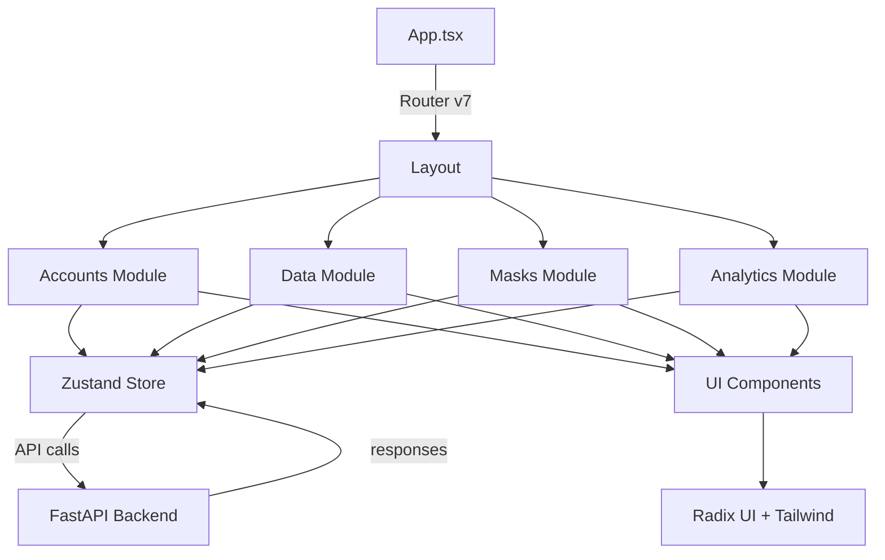

# 08. Структура фронтенда KeySet-MVP (React Router v7)

> **Документация архитектуры frontend: React 19 + TypeScript + Vite + Zustand**

## 📋 Содержание

- [Цель](#цель)
- [Для кого](#для-кого)
- [Связанные документы](#связанные-документы)
- [Архитектура frontend](#архитектура-frontend)
- [Диаграмма модулей](#диаграмма-модулей)
- [Технологический стек](#технологический-стек)
- [Сниппеты кода](#сниппеты-кода)
- [Типовые ошибки](#типовые-ошибки)
- [Быстрый старт](#быстрый-старт)
- [TL;DR](#tldr)
- [Чек-лист применения](#чек-лист-применения)

---

## Цель

Документация структуры frontend приложения KeySet-MVP: модульная архитектура, routing React Router v7, state management через Zustand, UI компоненты на базе Radix UI.

## Для кого

- Frontend разработчики, работающие с UI
- Tech Lead для архитектурных решений
- QA для понимания структуры приложения
- DevOps для настройки сборки

## Связанные документы

- [09_TABS_OVERVIEW.md](./09_TABS_OVERVIEW.md) — обзор вкладок UI
- [10_API_INTEGRATION.md](./10_API_INTEGRATION.md) — интеграция с backend
- [11_DATA_FLOW.md](./11_DATA_FLOW.md) — потоки данных

---

## Архитектура frontend



---

## Диаграмма модулей

```mermaid
graph LR
    subgraph Frontend
        A[React 19] --> B[React Router v7]
        B --> C[Pages/Routes]
        
        C --> D1[/accounts]
        C --> D2[/data]
        C --> D3[/masks]
        C --> D4[/analytics]
        
        E[Zustand Stores] --> E1[accountsStore]
        E --> E2[dataStore]
        E --> E3[masksStore]
        
        F[Components] --> F1[AccountsTable]
        F --> F2[DataGrid]
        F --> F3[MasksEditor]
        
        G[UI Kit] --> G1[Radix UI]
        G --> G2[Tailwind CSS]
        G --> G3[Lucide Icons]
    end
```

---

## Технологический стек

### Core
- **React 19.1.1** — UI библиотека
- **TypeScript 5.9.3** — типизация
- **Vite 7.1.7** — сборщик

### Routing
- **React Router v7.9.5** — маршрутизация

### State Management
- **Zustand 5.0.8** — глобальный state

### UI Components
- **Radix UI** — headless компоненты
- **Tailwind CSS** — стилизация
- **Lucide React** — иконки

### Data & Forms
- **TanStack Table 8.21.3** — таблицы
- **React Hook Form 7.66.0** — формы
- **Zod 4.1.12** — валидация

### Utilities
- **date-fns 4.1.0** — работа с датами
- **XLSX 0.18.5** — экспорт в Excel
- **PapaParse 5.5.3** — CSV парсинг

---

## Сниппеты кода

### Главная структура приложения

```typescript
// файл: frontend/src/App.tsx:1-21
import { Navigate, Route, Routes } from "react-router";
import { AppLayout } from "./components/layout/AppLayout";
import AccountsModule from "./modules/accounts";
import MasksModule from "./modules/masks";
import DataModule from "./modules/data";
import AnalyticsModule from "./modules/analytics";

export function App() {
  return (
    <AppLayout>
      <Routes>
        <Route path="/" element={<Navigate to="/accounts" replace />} />
        <Route path="/accounts" element={<AccountsModule />} />
        <Route path="/masks" element={<MasksModule />} />
        <Route path="/data/*" element={<DataModule />} />
        <Route path="/analytics/*" element={<AnalyticsModule />} />
      </Routes>
    </AppLayout>
  );
}
```

### Zustand store с persistence

```typescript
// файл: frontend/src/modules/data/store/useStore.ts:35-78
const initialState: Omit<AppState, 'history'> = {
  phrases: [],
  groups: [],
  stopwords: [],
  filters: {},
  savedFilters: [],
  columnVisibility: {
    phrase: true,
    ws: true,
    qws: true,
    bws: true,
    status: true,
    dateAdded: false,
  },
  selectedPhraseIds: new Set(),
  selectedGroupId: null,
  activeGroupIds: new Set(),
  activityLog: [],
  processProgress: 0,
  processCurrent: 0,
  processTotal: 0,
  columnOrder: [],
  columnPinning: {},
  viewTemplates: [],
  searchMasks: [
    { id: '1', name: 'Google', url: 'https://www.google.com/search?q={QUERY}' },
    { id: '2', name: 'Yandex', url: 'https://yandex.ru/search/?text={QUERY}' },
  ],
  phraseColors: {},
  groupColors: {},
  pinnedPhraseIds: new Set(),
  footerStats: {},
  markedPhraseIds: new Set(),
  pinnedGroupIds: new Set(),
  snapshots: [],
  exportPresets: [],
  phraseTags: [],
  version: 5,
  isDataLoaded: false,
  isDataLoading: false,
  dataError: null,
  phrasesCursor: null,
};
```

### React Router v7 маршруты

```typescript
// файл: frontend/src/App.tsx:10-18
<AppLayout>
  <Routes>
    <Route path="/" element={<Navigate to="/accounts" replace />} />
    <Route path="/accounts" element={<AccountsModule />} />
    <Route path="/masks" element={<MasksModule />} />
    <Route path="/data/*" element={<DataModule />} />
    <Route path="/analytics/*" element={<AnalyticsModule />} />
  </Routes>
</AppLayout>
```

### Пример модуля (Accounts)

```typescript
// файл: frontend/src/modules/accounts/index.tsx:14-45
export default function AccountsModule() {
  const [accounts, setAccounts] = useState<Account[]>([]);
  const [isLoading, setIsLoading] = useState(true);
  const [error, setError] = useState<string | null>(null);
  const [filters, setFilters] = useState<AccountsFilters>({
    search: "",
    status: "",
    onlyWithProxy: false,
  });
  const [selectedIds, setSelectedIds] = useState<Set<number>>(new Set());
  const [currentAccount, setCurrentAccount] = useState<Account | null>(null);

  const loadAccounts = useCallback(async () => {
    setIsLoading(true);
    setError(null);
    try {
      const data = await fetchAccounts();
      setAccounts(data);
    } catch (loadError) {
      setAccounts([]);
      setError(
        (loadError as Error).message ||
          "Не удалось загрузить аккаунты. Проверьте backend."
      );
    } finally {
      setIsLoading(false);
    }
  }, []);

  useEffect(() => {
    loadAccounts();
  }, [loadAccounts]);
```

### API client интеграция

```typescript
// файл: frontend/src/modules/accounts/api.ts:1-19
import type { Account } from "./types";

const BASE_URL = "/api/accounts";

export async function fetchAccounts(): Promise<Account[]> {
  const response = await fetch(BASE_URL, {
    headers: {
      "Content-Type": "application/json",
    },
  });

  if (!response.ok) {
    const message = await response.text();
    throw new Error(message || `Accounts API error (${response.status})`);
  }

  return (await response.json()) as Account[];
}
```

---

## Типовые ошибки / Как чинить

### ❌ Ошибка: "Cannot read property of undefined" в Zustand

**Причина:** Store не инициализирован или данные ещё не загружены.

**Как чинить:**
1. Инициализируйте `initialState` всеми полями (см. `useStore.ts`) и избегайте `undefined`.
2. В компонентах используйте `const phrase = store.phrases?.[index] ?? null` и проверяйте `isDataLoaded`.
3. Помните, что `persist` middleware читает state асинхронно — выводите UI-шаблон до завершения гидратации (`useEffect`).

### ❌ Ошибка: "React Router v7 navigation not working"

**Причина:** Некорректная настройка routes или basename.

**Как чинить:**
1. Убедитесь, что `<AppLayout>` оборачивает `<Routes>`, а `<BrowserRouter>` инициализирован в `main.tsx`.
2. Для редиректов используйте `<Navigate to="/accounts" replace />`, а не `useNavigate` в эффектах.
3. В desktop-сборке используйте `basename={window.__KEYSET_BASE__ ?? '/'}` чтобы роутинг совпадал с путями в Inno Setup.

### ❌ Ошибка: "Hydration mismatch"

**Причина:** Несоответствие между SSR и client-side рендером.

**Как чинить:**
1. Вынесите операции с `window`/`localStorage` в `useEffect`.
2. Зафиксируйте часовой пояс/формат дат при генерации `initialState`, чтобы сервер и клиент совпадали.
3. Используйте `suppressHydrationWarning` во время отладки и логируйте расхождения.

---

## Быстрый старт

### 1. Установка зависимостей

```bash
cd frontend
npm install
```

### 2. Запуск dev сервера

```bash
npm run dev
# Откроется на http://localhost:5173
```

### 3. Создание нового модуля

```typescript
// src/modules/mymodule/MyModule.tsx
import { useMyStore } from '@/stores/myStore';

export const MyModule = () => {
  const { data, fetchData } = useMyStore();
  
  return <div>My Module</div>;
};
```

### 4. Добавление маршрута

```typescript
// src/routes.tsx
{
  path: '/mymodule',
  element: <MyModule />
}
```

---

## TL;DR

- **React 19** — современная версия React
- **React Router v7** — маршрутизация
- **Zustand** — простой и быстрый state management
- **Radix UI** — headless компоненты для доступности
- **Vite** — быстрая сборка и HMR
- **TypeScript** — типобезопасность

---

## Чек-лист применения

- [ ] Node.js 18+ установлен
- [ ] Зависимости установлены (npm install)
- [ ] Vite dev server запускается
- [ ] React Router маршруты настроены
- [ ] Zustand stores созданы для модулей
- [ ] API client настроен для backend
- [ ] TypeScript конфиг корректный
- [ ] Tailwind CSS работает
- [ ] Radix UI компоненты подключены
- [ ] Build проходит без ошибок (npm run build)

---

**Последнее обновление:** 2024-11-10

**Следующий шаг:** [09_TABS_OVERVIEW.md](./09_TABS_OVERVIEW.md) — Обзор вкладок UI
