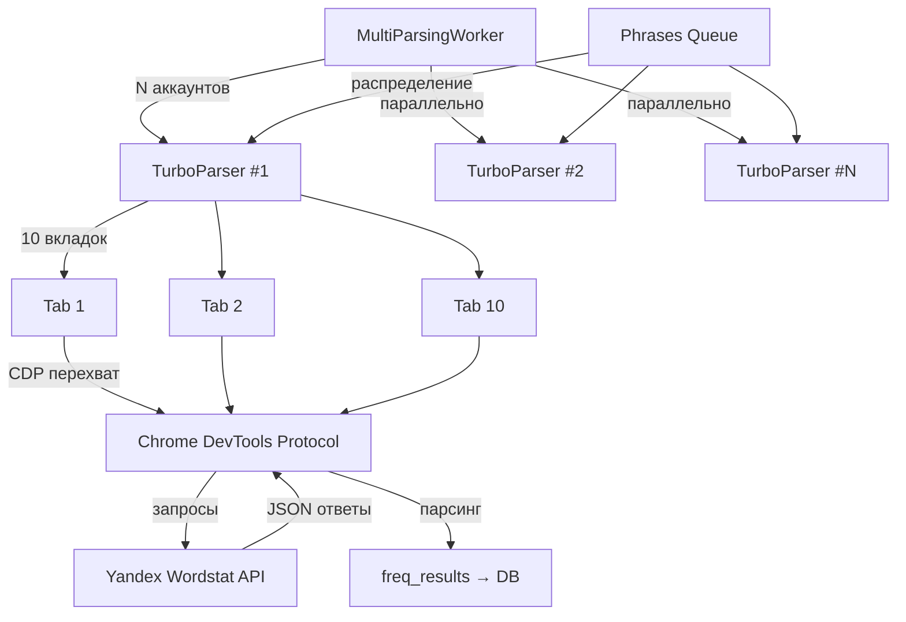
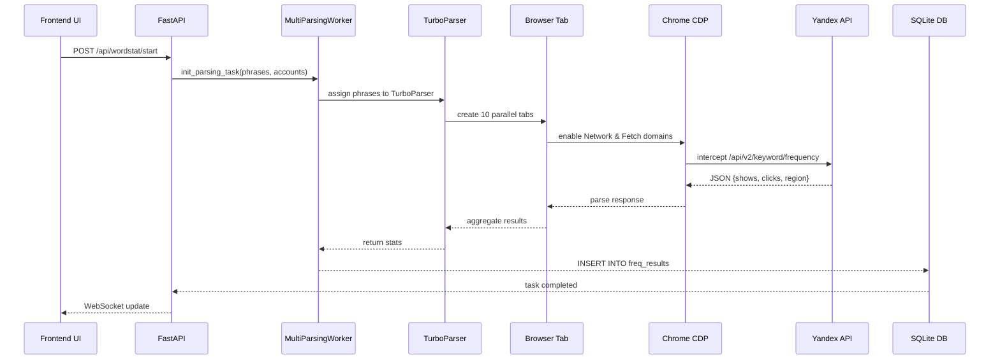

# 06. Парсинг системы KeySet-MVP

> **Документация архитектуры парсинга Yandex Wordstat через CDP и Playwright**

## 📋 Содержание

- [Цель](#цель)
- [Для кого](#для-кого)
- [Связанные документы](#связанные-документы)
- [Архитектура парсера](#архитектура-парсера)
- [Диаграмма потока](#диаграмма-потока)
- [Ключевые компоненты](#ключевые-компоненты)
- [Сниппеты кода](#сниппеты-кода)
- [Типовые ошибки](#типовые-ошибки)
- [Быстрый старт](#быстрый-старт)
- [TL;DR](#tldr)
- [Чек-лист применения](#чек-лист-применения)

---

## Цель

Документация системы парсинга KeySet-MVP: TurboParser с CDP перехватом, параллельная обработка 10 вкладок на аккаунт, N аккаунтов одновременно, производительность ~526 фраз/минуту.

## Для кого

- Backend разработчики, работающие с парсером
- DevOps инженеры для настройки окружения
- QA для понимания граничных случаев
- Tech Lead для оценки производительности

## Связанные документы

- [02_AUTHENTICATION.md](./02_AUTHENTICATION.md) — аутентификация и cookies
- [03_ACCOUNTS_PROFILES.md](./03_ACCOUNTS_PROFILES.md) — управление аккаунтами
- [04_PROXY_CONNECTIONS.md](./04_PROXY_CONNECTIONS.md) — прокси система
- [07_GEO_SYSTEM.md](./07_GEO_SYSTEM.md) — подмена региона
- [11_DATA_FLOW.md](./11_DATA_FLOW.md) — потоки данных
- [14_LOGGING_OBSERVABILITY.md](./14_LOGGING_OBSERVABILITY.md) — логирование

---

## Архитектура парсера



## Диаграмма потока

**Жизненный цикл парсинга одной фразы:**



---

## Ключевые компоненты

### 1. TurboParser

Основной парсер с параллельными вкладками.

### 2. MultiParsingWorker

Оркестратор для N аккаунтов одновременно.

### 3. CDP (Chrome DevTools Protocol)

Перехват и модификация сетевых запросов.

### 4. Phrase Distribution

Алгоритм распределения фраз между вкладками.

---

## Сниппеты кода

### TurboParser инициализация

```python
# файл: keyset/workers/turbo_parser_working.py:131-154
async with async_playwright() as p:
    # 1. ЗАПУСК CHROME
    log("[1/6] Запуск Chrome с профилем wordstat_main...")
    context = await p.chromium.launch_persistent_context(
        user_data_dir="C:\\AI\\yandex\\.profiles\\wordstat_main",
        headless=False,
        channel="chrome",
        args=[
            '--start-maximized',
            '--disable-blink-features=AutomationControlled',
            '--disable-features=IsolateOrigins,site-per-process',
            '--disable-site-isolation-trials'
        ],
        viewport=None,
        locale='ru-RU'
    )
    await context.add_init_script(script=WORDSTAT_FETCH_NORMALIZER_SCRIPT)
    for existing in context.pages:
        await existing.add_init_script(script=WORDSTAT_FETCH_NORMALIZER_SCRIPT)
        try:
            await existing.evaluate(WORDSTAT_FETCH_NORMALIZER_SCRIPT)
        except Exception:
            pass
```

### CDP перехват запросов

```python
# файл: keyset/workers/cdp_frequency_runner.py:60-81
async def on_response(response: Response):
    nonlocal captured_csv_url
    url = response.url
    content_type = response.headers.get("content-type", "")
    
    # Ловим CSV от Wordstat
    if "wordstat" in url and ("csv" in content_type or "export" in url or "download" in url):
        print(f"[CDP] Поймал CSV URL: {url}")
        captured_csv_url = url
        
        # Сохраняем тело для анализа
        try:
            body = await response.body()
            self.captured_data.append({
                "url": url,
                "type": "csv",
                "body": body.decode("utf-8", "ignore")
            })
        except Exception as e:
            print(f"[CDP] Ошибка чтения CSV: {e}")

page.on("response", on_response)
```

### MultiParsingWorker запуск

```python
# файл: keyset/services/multiparser_manager.py:399-434
def submit_tasks(self, profiles: List[Dict], phrases: List[str]) -> List[str]:
    """
    Отправить задачи на выполнение
    
    Args:
        profiles: Список профилей с данными
        phrases: Список фраз для парсинга
        
    Returns:
        Список task_id созданных задач
    """
    task_ids = []
    futures = {}
    
    for profile in profiles:
        # Создаем задачу
        task = self.create_task(
            profile_email=profile['email'],
            profile_path=profile['profile_path'],
            proxy_uri=profile.get('proxy'),
            phrases=phrases
        )
        task_ids.append(task.task_id)
        
        # Отправляем на выполнение
        future = self.executor.submit(self._run_parser_task, task)
        futures[future] = task.task_id
        
    # Запускаем обработку результатов в отдельном потоке
    threading.Thread(
        target=self._process_futures,
        args=(futures,),
        daemon=True
    ).start()
    
    return task_ids
```

### Алгоритм распределения фраз

```python
# файл: keyset/workers/turbo_parser_working.py:296-309
# Распределение фраз по вкладкам
chunks = []
chunk_size = len(phrases) // len(working_pages)

for i in range(len(working_pages)):
    start_idx = i * chunk_size
    if i == len(working_pages) - 1:
        chunks.append(phrases[start_idx:])
    else:
        chunks.append(phrases[start_idx:start_idx + chunk_size])

log("[OK] Распределение фраз по вкладкам:")
for i, chunk in enumerate(chunks):
    log(f"  * Вкладка {i+1}: {len(chunk)} фраз")
```

---

## Типовые ошибки / Как чинить

### ❌ Ошибка: "Chrome process crashed"

**Причина:** Нехватка ресурсов или конфликт процессов.

**Как чинить:**
1. Уменьшить `max_workers` у `MultiParserManager`, чтобы снизить конкурентную нагрузку.
2. Завершить зомби-процессы Chrome (`taskkill /IM chrome.exe /F`) и очистить временные профили.
3. Добавить мониторинг RAM/CPU и увеличить лимиты ВМ минимум до 6 ГБ оперативной памяти.

### ❌ Ошибка: "CDP session closed unexpectedly"

**Причина:** Вкладка закрылась или зависла.

**Как чинить:**
1. Обернуть `context.new_page()` и `page.goto()` в retry с экспоненциальной задержкой.
2. Навешивать обработчики `page.on("response", ...)` до первого `page.goto` и проверять `page.is_closed()` каждые 30 секунд.
3. Держать health-check: пересоздавать вкладку, если `page.context` потерял соединение.

### ❌ Ошибка: "No responses intercepted"

**Причина:** CDP не успел подключиться к Network domain.

**Как чинить:**
1. Вызывать `page.route`/`page.on` до `page.goto` и ждать `wait_for_event("response")` с таймаутом 5 секунд.
2. Убедиться, что `WORDSTAT_FETCH_NORMALIZER_SCRIPT` добавлен через `context.add_init_script` до навигации.
3. Проверить фильтр URL: он должен включать `/wordstat/api` и `statistics/v1/data?format=csv`.

---

## Быстрый старт

### 1. Запуск парсинга из Python

```python
from keyset.services.multiparser_manager import MultiParsingManager

manager = MultiParsingManager()
task_id = await manager.start_parsing(
    phrases=["купить квартиру", "аренда дома"],
    account_ids=[1, 2, 3],
    region_id=213  # Москва
)
```

### 2. Запуск через API

```bash
curl -X POST http://localhost:8000/api/wordstat/start \
  -H "Content-Type: application/json" \
  -d '{
    "phrases": ["купить квартиру"],
    "account_ids": [1],
    "region_id": 213
  }'
```

### 3. Мониторинг статуса

```python
status = await manager.get_task_status(task_id)
print(f"Processed: {status['processed']}/{status['total']}")
```

---

## TL;DR

- **TurboParser** — 10 параллельных вкладок на аккаунт
- **MultiParsingWorker** — N аккаунтов одновременно
- **CDP перехват** — модификация API запросов на лету
- **Производительность** — ~526 фраз/минуту (5 аккаунтов × 10 вкладок)
- **Retry логика** — автоматическая обработка ошибок
- **Real-time обновления** — через WebSocket

---

## Чек-лист применения

- [ ] Установлен Chrome/Chromium в системе
- [ ] Playwright установлен и настроен
- [ ] CDP перехват включен перед navigate
- [ ] Аккаунты авторизованы и имеют валидные cookies
- [ ] Прокси настроены (если используются)
- [ ] Фразы корректно распределены между вкладками
- [ ] Retry логика реализована для ошибок
- [ ] Логирование настроено для отладки
- [ ] Тесты покрывают основные сценарии
- [ ] Производительность оптимизирована

---

**Последнее обновление:** 2024-11-10

**Следующий шаг:** [07_GEO_SYSTEM.md](./07_GEO_SYSTEM.md) — Географическая система
