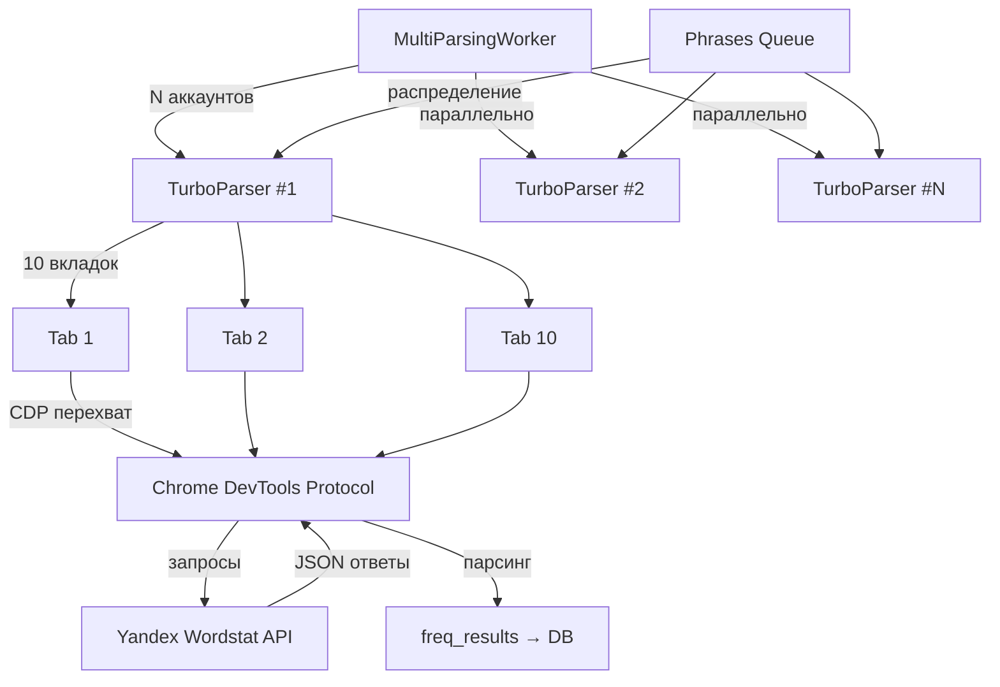
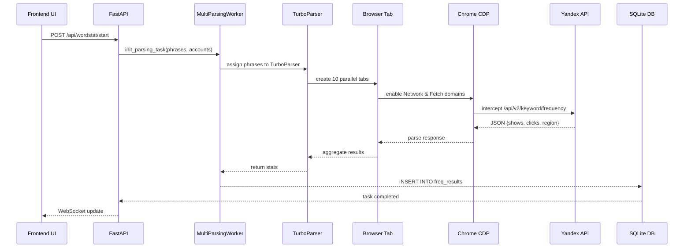

# 06. Парсинг системы KeySet-MVP

> **Документация архитектуры парсинга Yandex Wordstat через CDP и Playwright**

## 📋 Содержание

- [Цель](#цель)
- [Для кого](#для-кого)
- [Связанные документы](#связанные-документы)
- [Архитектура парсера](#архитектура-парсера)
- [Диаграмма потока](#диаграмма-потока)
- [Ключевые компоненты](#ключевые-компоненты)
- [Сниппеты кода](#сниппеты-кода)
- [Типовые ошибки](#типовые-ошибки)
- [Быстрый старт](#быстрый-старт)
- [TL;DR](#tldr)
- [Чек-лист применения](#чек-лист-применения)

---

## Цель

Документация системы парсинга KeySet-MVP: TurboParser с CDP перехватом, параллельная обработка 10 вкладок на аккаунт, N аккаунтов одновременно, производительность ~526 фраз/минуту.

## Для кого

- Backend разработчики, работающие с парсером
- DevOps инженеры для настройки окружения
- QA для понимания граничных случаев
- Tech Lead для оценки производительности

## Связанные документы

- [02_AUTHENTICATION.md](./02_AUTHENTICATION.md) — аутентификация и cookies
- [03_ACCOUNTS_PROFILES.md](./03_ACCOUNTS_PROFILES.md) — управление аккаунтами
- [04_PROXY_CONNECTIONS.md](./04_PROXY_CONNECTIONS.md) — прокси система
- [07_GEO_SYSTEM.md](./07_GEO_SYSTEM.md) — подмена региона
- [11_DATA_FLOW.md](./11_DATA_FLOW.md) — потоки данных
- [14_LOGGING_OBSERVABILITY.md](./14_LOGGING_OBSERVABILITY.md) — логирование

---

## Архитектура парсера



## Диаграмма потока

**Жизненный цикл парсинга одной фразы:**



---

## Ключевые компоненты

### 1. TurboParser

Основной парсер с параллельными вкладками.

### 2. MultiParsingWorker

Оркестратор для N аккаунтов одновременно.

### 3. CDP (Chrome DevTools Protocol)

Перехват и модификация сетевых запросов.

### 4. Phrase Distribution

Алгоритм распределения фраз между вкладками.

---

## Сниппеты кода

### TurboParser инициализация

```python
# файл: keyset/workers/turbo_parser_working.py:TBD-TBD
```

### CDP перехват запросов

```python
# файл: keyset/workers/cdp_frequency_runner.py:TBD-TBD
```

### MultiParsingWorker запуск

```python
# файл: keyset/services/multiparser_manager.py:TBD-TBD
```

### Алгоритм распределения фраз

```python
# файл: keyset/workers/turbo_parser_working.py:TBD-TBD
```

---

## Типовые ошибки

### ❌ Ошибка: "Chrome process crashed"

**Причина:** Нехватка ресурсов или конфликт процессов.

**Решение:**
- Ограничить количество параллельных аккаунтов
- Увеличить RAM
- Закрыть лишние Chrome процессы

### ❌ Ошибка: "CDP session closed unexpectedly"

**Причина:** Вкладка закрылась или зависла.

**Решение:**
- Реализовать retry логику
- Добавить timeout на операции
- Логировать состояние вкладок

### ❌ Ошибка: "No responses intercepted"

**Причина:** CDP не успел подключиться к Network domain.

**Решение:**
- Включать CDP перехват до первого navigate
- Добавить ожидание после enable
- Проверить корректность паттернов перехвата

---

## Быстрый старт

### 1. Запуск парсинга из Python

```python
from keyset.services.multiparser_manager import MultiParsingManager

manager = MultiParsingManager()
task_id = await manager.start_parsing(
    phrases=["купить квартиру", "аренда дома"],
    account_ids=[1, 2, 3],
    region_id=213  # Москва
)
```

### 2. Запуск через API

```bash
curl -X POST http://localhost:8000/api/wordstat/start \
  -H "Content-Type: application/json" \
  -d '{
    "phrases": ["купить квартиру"],
    "account_ids": [1],
    "region_id": 213
  }'
```

### 3. Мониторинг статуса

```python
status = await manager.get_task_status(task_id)
print(f"Processed: {status['processed']}/{status['total']}")
```

---

## TL;DR

- **TurboParser** — 10 параллельных вкладок на аккаунт
- **MultiParsingWorker** — N аккаунтов одновременно
- **CDP перехват** — модификация API запросов на лету
- **Производительность** — ~526 фраз/минуту (5 аккаунтов × 10 вкладок)
- **Retry логика** — автоматическая обработка ошибок
- **Real-time обновления** — через WebSocket

---

## Чек-лист применения

- [ ] Установлен Chrome/Chromium в системе
- [ ] Playwright установлен и настроен
- [ ] CDP перехват включен перед navigate
- [ ] Аккаунты авторизованы и имеют валидные cookies
- [ ] Прокси настроены (если используются)
- [ ] Фразы корректно распределены между вкладками
- [ ] Retry логика реализована для ошибок
- [ ] Логирование настроено для отладки
- [ ] Тесты покрывают основные сценарии
- [ ] Производительность оптимизирована

---

**Последнее обновление:** 2024-11-10

**Следующий шаг:** [07_GEO_SYSTEM.md](./07_GEO_SYSTEM.md) — Географическая система
