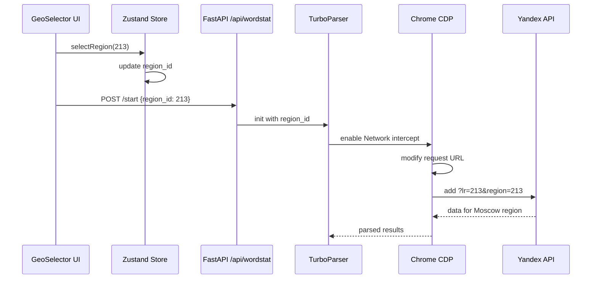

# 07. Географическая система KeySet-MVP

> **Документация системы работы с регионами: 4414+ гео, CDP-патчинг, GeoSelector виджет**

## 📋 Содержание

- [Цель](#цель)
- [Для кого](#для-кого)
- [Связанные документы](#связанные-документы)
- [Архитектура геосистемы](#архитектура-геосистемы)
- [Диаграмма](#диаграмма)
- [Структура regions.json](#структура-regionsjson)
- [Сниппеты кода](#сниппеты-кода)
- [Типовые ошибки](#типовые-ошибки)
- [Быстрый старт](#быстрый-старт)
- [TL;DR](#tldr)
- [Чек-лист применения](#чек-лист-применения)

---

## Цель

Документация географической системы KeySet-MVP: дерево из 4414+ регионов Yandex, автоматическая подстановка region_id в API запросы через CDP, UI виджет выбора региона.

## Для кого

- Frontend разработчики, работающие с GeoSelector
- Backend разработчики для CDP-патчинга
- QA для тестирования работы регионов
- Product managers для понимания coverage

## Связанные документы

- [06_PARSING.md](./06_PARSING.md) — парсинг с учетом региона
- [11_DATA_FLOW.md](./11_DATA_FLOW.md) — поток данных с регионом
- [08_FRONTEND_STRUCTURE.md](./08_FRONTEND_STRUCTURE.md) — UI компоненты

---

## Архитектура геосистемы

```mermaid
graph TD
    A[regions.json 4414+ регионов] -->|загрузка| B[Backend GeoService]
    A -->|загрузка| C[Frontend GeoStore]
    
    B -->|API| D[/api/regions]
    C -->|виджет| E[GeoSelector UI]
    
    E -->|выбор| F[region_id]
    F -->|передача| G[Парсинг задача]
    
    G -->|запуск| H[TurboParser]
    H -->|CDP перехват| I[Browser Tab]
    
    I -->|патчинг| J[Yandex API запрос]
    J -->|lr=region_id| K[?lr=213&text=фраза]
    
    K -->|запрос| L[Yandex Wordstat]
    L -->|результаты для региона| M[freq_results]
```

---

## Диаграмма

**Поток выбора и применения региона:**



---

## Структура regions.json

```json
{
  "regions": [
    {
      "id": 213,
      "name": "Москва",
      "parent_id": 1,
      "type": "city"
    },
    {
      "id": 2,
      "name": "Санкт-Петербург",
      "parent_id": 10174,
      "type": "city"
    }
  ]
}
```

---

## Сниппеты кода

### GeoSelector виджет

```python
# файл: keyset/app/widgets/geo_selector.py:TBD-TBD
```

### CDP патчинг region параметров

```python
# файл: keyset/workers/cdp_frequency_runner.py:TBD-TBD
```

### Загрузка regions.json

```python
# файл: keyset/core/regions.py:TBD-TBD
```

### GeoTree структура

```python
# файл: keyset/app/widgets/geo_tree.py:TBD-TBD
```

---

## Типовые ошибки

### ❌ Ошибка: "Region not found"

**Причина:** Некорректный region_id передан в API.

**Решение:**
- Валидировать region_id перед отправкой
- Проверить наличие региона в regions.json
- Добавить fallback на дефолтный регион

### ❌ Ошибка: "CDP не подставляет region"

**Причина:** Перехват запросов настроен после navigate.

**Решение:**
- Включить CDP Network domain до первого запроса
- Проверить паттерн URL для перехвата
- Убедиться что region_id передан в параметрах

### ❌ Ошибка: "Неверные результаты для региона"

**Причина:** Кэширование на стороне Yandex.

**Решение:**
- Добавить случайный параметр в URL
- Использовать разные User-Agent
- Проверить корректность lr параметра

---

## Быстрый старт

### 1. Загрузка списка регионов

```python
from keyset.services.geo_service import GeoService

geo = GeoService()
regions = geo.get_all_regions()
print(f"Loaded {len(regions)} regions")
```

### 2. Выбор региона в UI

```typescript
import { useGeoStore } from '@/stores/geo';

const { selectedRegion, setRegion } = useGeoStore();

// Выбрать Москву
setRegion(213);
```

### 3. Парсинг с регионом

```python
task_id = await manager.start_parsing(
    phrases=["купить квартиру"],
    account_ids=[1],
    region_id=213  # Москва
)
```

---

## TL;DR

- **4414+ регионов** — полное дерево Yandex геолокаций
- **CDP-патчинг** — автоподстановка lr/region в API запросы
- **GeoSelector UI** — удобный виджет выбора региона
- **regions.json** — единый источник правды для гео
- **Валидация** — проверка region_id на frontend и backend

---

## Чек-лист применения

- [ ] regions.json загружен и доступен
- [ ] GeoSelector виджет подключен в UI
- [ ] CDP перехват настроен для подстановки региона
- [ ] region_id передается через все слои (UI → API → Parser)
- [ ] Валидация region_id реализована
- [ ] Тесты покрывают разные регионы
- [ ] Логирование region_id в запросах
- [ ] Fallback на дефолтный регион если не указан
- [ ] UI показывает выбранный регион
- [ ] Результаты парсинга сохраняются с region_id

---

**Последнее обновление:** 2024-11-10

**Следующий шаг:** [08_FRONTEND_STRUCTURE.md](./08_FRONTEND_STRUCTURE.md) — Структура фронтенда
