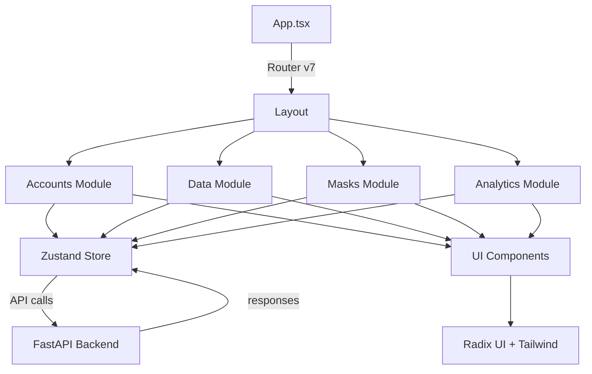

# 08. Структура фронтенда KeySet-MVP (React Router v7)

> **Документация архитектуры frontend: React 19 + TypeScript + Vite + Zustand**

## 📋 Содержание

- [Цель](#цель)
- [Для кого](#для-кого)
- [Связанные документы](#связанные-документы)
- [Архитектура frontend](#архитектура-frontend)
- [Диаграмма модулей](#диаграмма-модулей)
- [Технологический стек](#технологический-стек)
- [Сниппеты кода](#сниппеты-кода)
- [Типовые ошибки](#типовые-ошибки)
- [Быстрый старт](#быстрый-старт)
- [TL;DR](#tldr)
- [Чек-лист применения](#чек-лист-применения)

---

## Цель

Документация структуры frontend приложения KeySet-MVP: модульная архитектура, routing React Router v7, state management через Zustand, UI компоненты на базе Radix UI.

## Для кого

- Frontend разработчики, работающие с UI
- Tech Lead для архитектурных решений
- QA для понимания структуры приложения
- DevOps для настройки сборки

## Связанные документы

- [09_TABS_OVERVIEW.md](./09_TABS_OVERVIEW.md) — обзор вкладок UI
- [10_API_INTEGRATION.md](./10_API_INTEGRATION.md) — интеграция с backend
- [11_DATA_FLOW.md](./11_DATA_FLOW.md) — потоки данных

---

## Архитектура frontend



---

## Диаграмма модулей

```mermaid
graph LR
    subgraph Frontend
        A[React 19] --> B[React Router v7]
        B --> C[Pages/Routes]
        
        C --> D1[/accounts]
        C --> D2[/data]
        C --> D3[/masks]
        C --> D4[/analytics]
        
        E[Zustand Stores] --> E1[accountsStore]
        E --> E2[dataStore]
        E --> E3[masksStore]
        
        F[Components] --> F1[AccountsTable]
        F --> F2[DataGrid]
        F --> F3[MasksEditor]
        
        G[UI Kit] --> G1[Radix UI]
        G --> G2[Tailwind CSS]
        G --> G3[Lucide Icons]
    end
```

---

## Технологический стек

### Core
- **React 19.1.1** — UI библиотека
- **TypeScript 5.9.3** — типизация
- **Vite 7.1.7** — сборщик

### Routing
- **React Router v7.9.5** — маршрутизация

### State Management
- **Zustand 5.0.8** — глобальный state

### UI Components
- **Radix UI** — headless компоненты
- **Tailwind CSS** — стилизация
- **Lucide React** — иконки

### Data & Forms
- **TanStack Table 8.21.3** — таблицы
- **React Hook Form 7.66.0** — формы
- **Zod 4.1.12** — валидация

### Utilities
- **date-fns 4.1.0** — работа с датами
- **XLSX 0.18.5** — экспорт в Excel
- **PapaParse 5.5.3** — CSV парсинг

---

## Сниппеты кода

### Главная структура приложения

```typescript
// файл: frontend/src/App.tsx:TBD-TBD
```

### Zustand store пример

```typescript
// файл: frontend/src/modules/data/store/useStore.ts:TBD-TBD
```

### React Router v7 маршруты

```typescript
// файл: frontend/src/App.tsx:TBD-TBD
```

### Пример модуля (Accounts)

```typescript
// файл: frontend/src/modules/accounts/index.tsx:TBD-TBD
```

### API client интеграция

```typescript
// файл: frontend/src/lib/api.ts:TBD-TBD
```

---

## Типовые ошибки

### ❌ Ошибка: "Cannot read property of undefined" в Zustand

**Причина:** Store не инициализирован или данные еще не загружены.

**Решение:**
- Добавить проверку на undefined
- Использовать optional chaining (?.)
- Инициализировать store с дефолтными значениями

### ❌ Ошибка: "React Router v7 navigation not working"

**Причина:** Некорректная настройка routes или basename.

**Решение:**
- Проверить структуру routes
- Убедиться что Router правильно обернут
- Использовать правильные хуки (useNavigate, useLocation)

### ❌ Ошибка: "Hydration mismatch"

**Причина:** Несоответствие между SSR и client-side рендером.

**Решение:**
- Убедиться что начальный state одинаковый
- Использовать useEffect для client-only кода
- Проверить условный рендеринг

---

## Быстрый старт

### 1. Установка зависимостей

```bash
cd frontend
npm install
```

### 2. Запуск dev сервера

```bash
npm run dev
# Откроется на http://localhost:5173
```

### 3. Создание нового модуля

```typescript
// src/modules/mymodule/MyModule.tsx
import { useMyStore } from '@/stores/myStore';

export const MyModule = () => {
  const { data, fetchData } = useMyStore();
  
  return <div>My Module</div>;
};
```

### 4. Добавление маршрута

```typescript
// src/routes.tsx
{
  path: '/mymodule',
  element: <MyModule />
}
```

---

## TL;DR

- **React 19** — современная версия React
- **React Router v7** — маршрутизация
- **Zustand** — простой и быстрый state management
- **Radix UI** — headless компоненты для доступности
- **Vite** — быстрая сборка и HMR
- **TypeScript** — типобезопасность

---

## Чек-лист применения

- [ ] Node.js 18+ установлен
- [ ] Зависимости установлены (npm install)
- [ ] Vite dev server запускается
- [ ] React Router маршруты настроены
- [ ] Zustand stores созданы для модулей
- [ ] API client настроен для backend
- [ ] TypeScript конфиг корректный
- [ ] Tailwind CSS работает
- [ ] Radix UI компоненты подключены
- [ ] Build проходит без ошибок (npm run build)

---

**Последнее обновление:** 2024-11-10

**Следующий шаг:** [09_TABS_OVERVIEW.md](./09_TABS_OVERVIEW.md) — Обзор вкладок UI
