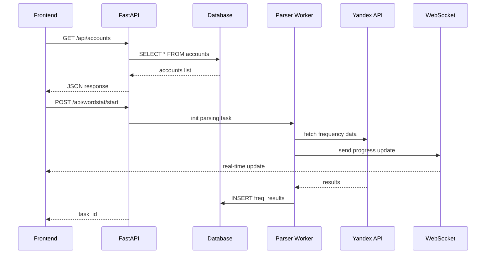

# 10. API интеграция KeySet-MVP

> **Документация REST API: FastAPI endpoints, WebSocket real-time, интеграция с Yandex**

## 📋 Содержание

- [Цель](#цель)
- [Для кого](#для-кого)
- [Связанные документы](#связанные-документы)
- [Архитектура API](#архитектура-api)
- [Диаграмма эндпоинтов](#диаграмма-эндпоинтов)
- [REST API endpoints](#rest-api-endpoints)
- [Сниппеты кода](#сниппеты-кода)
- [Типовые ошибки](#типовые-ошибки)
- [Быстрый старт](#быстрый-старт)
- [TL;DR](#tldr)
- [Чек-лист применения](#чек-лист-применения)

---

## Цель

Документация REST API KeySet-MVP: FastAPI endpoints для управления аккаунтами, запуска парсинга, получения данных, WebSocket для real-time обновлений.

## Для кого

- Backend разработчики для расширения API
- Frontend разработчики для интеграции
- QA для тестирования API
- DevOps для настройки deployment

## Связанные документы

- [08_FRONTEND_STRUCTURE.md](./08_FRONTEND_STRUCTURE.md) — frontend клиент
- [06_PARSING.md](./06_PARSING.md) — парсинг система
- [11_DATA_FLOW.md](./11_DATA_FLOW.md) — потоки данных
- [01_DATABASE.md](./01_DATABASE.md) — модели данных

---

## Архитектура API

```mermaid
graph TD
    A[Frontend Client] -->|HTTP/REST| B[FastAPI Server]
    A -->|WebSocket| C[WS Handler]
    
    B --> D1[/api/accounts]
    B --> D2[/api/data]
    B --> D3[/api/wordstat]
    B --> D4[/api/proxy]
    B --> D5[/api/regions]
    
    D1 --> E[Database Layer]
    D2 --> E
    D3 --> F[Parsing Worker]
    
    F --> G[TurboParser]
    G --> H[Yandex Wordstat API]
    
    C -->|updates| A
    F -->|progress| C
```

---

## Диаграмма эндпоинтов



---

## REST API endpoints

### Accounts Management

| Method | Endpoint | Description |
|--------|----------|-------------|
| GET | `/api/accounts` | Список всех аккаунтов |
| POST | `/api/accounts` | Создать аккаунт |
| PUT | `/api/accounts/{id}` | Обновить аккаунт |
| DELETE | `/api/accounts/{id}` | Удалить аккаунт |
| POST | `/api/accounts/{id}/test` | Тест подключения |

### Data Management

| Method | Endpoint | Description |
|--------|----------|-------------|
| GET | `/api/data/phrases` | Список фраз |
| GET | `/api/data/groups` | Список групп |
| POST | `/api/data/import` | Импорт CSV |
| DELETE | `/api/data/phrases/{id}` | Удалить фразу |

### Parsing

| Method | Endpoint | Description |
|--------|----------|-------------|
| POST | `/api/wordstat/start` | Запуск парсинга |
| GET | `/api/wordstat/status/{task_id}` | Статус задачи |
| POST | `/api/wordstat/stop/{task_id}` | Остановить парсинг |

### Proxy Management

| Method | Endpoint | Description |
|--------|----------|-------------|
| GET | `/api/proxy` | Список прокси |
| POST | `/api/proxy/test` | Тест прокси |

### Geo System

| Method | Endpoint | Description |
|--------|----------|-------------|
| GET | `/api/regions` | Список регионов |
| GET | `/api/regions/{id}` | Детали региона |

---

## Сниппеты кода

### FastAPI router (accounts)

```python
# файл: backend/routers/accounts.py:TBD-TBD
```

### FastAPI router (wordstat)

```python
# файл: backend/routers/wordstat.py:TBD-TBD
```

### WebSocket handler

```python
# файл: backend/main.py:TBD-TBD
```

### Frontend API client

```typescript
// файл: frontend/src/modules/data/api/data.ts:TBD-TBD
```

### Yandex API интеграция

```python
# файл: keyset/workers/turbo_parser_working.py:TBD-TBD
```

---

## Типовые ошибки

### ❌ Ошибка: "CORS policy blocking requests"

**Причина:** CORS не настроен на backend.

**Решение:**
```python
from fastapi.middleware.cors import CORSMiddleware

app.add_middleware(
    CORSMiddleware,
    allow_origins=["http://localhost:5173"],
    allow_methods=["*"],
    allow_headers=["*"],
)
```

### ❌ Ошибка: "422 Validation Error"

**Причина:** Некорректная структура request body.

**Решение:**
- Проверить Pydantic схему
- Убедиться что все обязательные поля переданы
- Проверить типы данных

### ❌ Ошибка: "WebSocket connection failed"

**Причина:** WS endpoint недоступен или неверный URL.

**Решение:**
- Проверить URL: `ws://localhost:8000/ws`
- Убедиться что backend запущен
- Проверить настройки proxy/nginx

---

## Быстрый старт

### 1. Запуск FastAPI сервера

```bash
cd backend
uvicorn app.main:app --reload --port 8000
```

### 2. Тест API endpoint

```bash
curl http://localhost:8000/api/accounts
```

### 3. Frontend API client

```typescript
import axios from 'axios';

const api = axios.create({
  baseURL: 'http://localhost:8000/api',
});

// Получить аккаунты
const accounts = await api.get('/accounts');
```

### 4. WebSocket connection

```typescript
const ws = new WebSocket('ws://localhost:8000/ws');

ws.onmessage = (event) => {
  const data = JSON.parse(event.data);
  console.log('Update:', data);
};
```

---

## TL;DR

- **FastAPI** — современный async framework
- **REST endpoints** — CRUD для всех сущностей
- **WebSocket** — real-time обновления
- **Pydantic** — валидация request/response
- **CORS** — настроен для frontend
- **Yandex API** — интеграция через CDP

---

## Чек-лист применения

- [ ] FastAPI сервер запущен
- [ ] CORS настроен для frontend origin
- [ ] Все endpoints отдают корректный JSON
- [ ] Pydantic схемы валидируют данные
- [ ] WebSocket handler реализован
- [ ] Error handling добавлен во все endpoints
- [ ] Логирование запросов настроено
- [ ] Rate limiting настроен (если нужен)
- [ ] API документация доступна (/docs)
- [ ] Frontend успешно подключается к API

---

**Последнее обновление:** 2024-11-10

**Следующий шаг:** [11_DATA_FLOW.md](./11_DATA_FLOW.md) — Потоки данных
