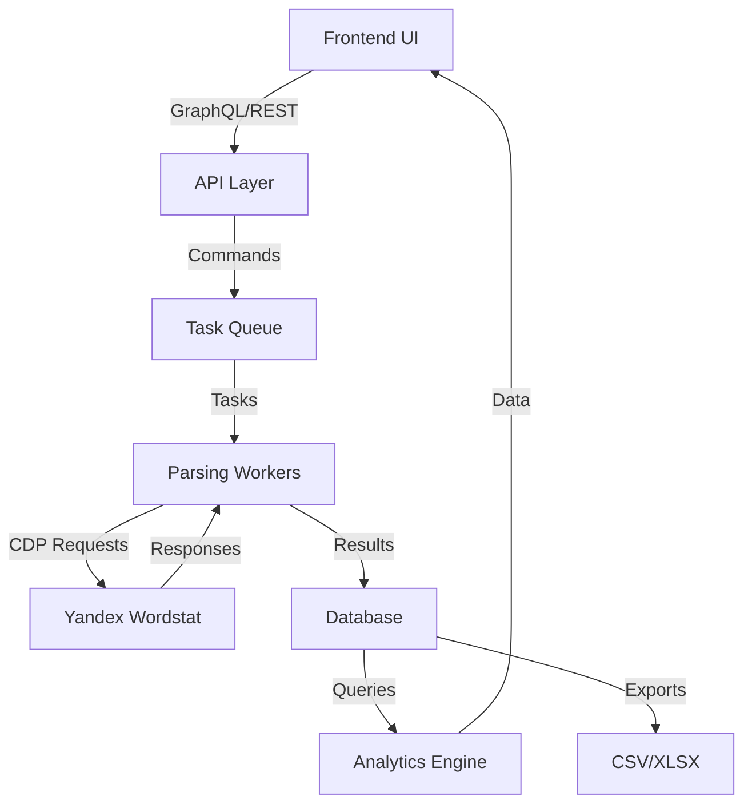
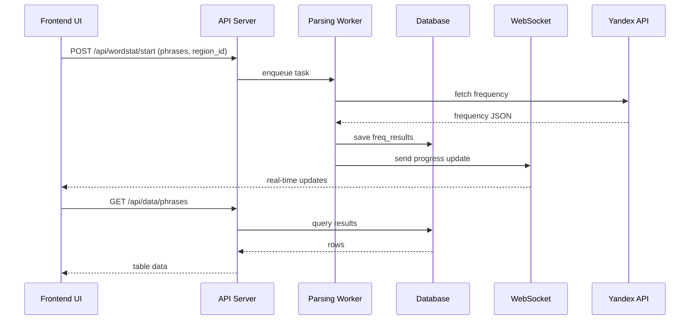
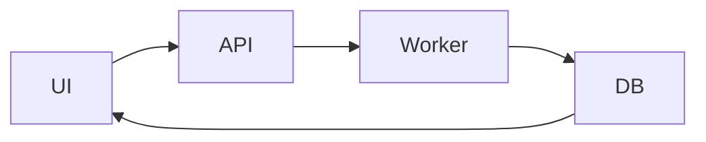

# 11. Потоки данных KeySet-MVP

> **Документация жизненного цикла данных: UI → API → Parser → DB → UI**

## 📋 Содержание

- [Цель](#цель)
- [Для кого](#для-кого)
- [Связанные документы](#связанные-документы)
- [Общая схема потока данных](#общая-схема-потока-данных)
- [Диаграмма последовательности](#диаграмма-последовательности)
- [Основные сценарии](#основные-сценарии)
- [Сниппеты кода](#сниппеты-кода)
- [Типовые ошибки](#типовые-ошибки)
- [Быстрый старт](#быстрый-старт)
- [TL;DR](#tldr)
- [Чек-лист применения](#чек-лист-применения)

---

## Цель

Документация потоков данных KeySet-MVP: от ввода фраз в UI до сохранения результатов в БД и отображения в аналитике.

## Для кого

- Tech Lead для оценки end-to-end потока
- Backend и frontend разработчики
- QA для тестирования сквозных сценариев
- Data analysts для понимания источников данных

## Связанные документы

- [06_PARSING.md](./06_PARSING.md) — парсинг система
- [10_API_INTEGRATION.md](./10_API_INTEGRATION.md) — API интеграция
- [01_DATABASE.md](./01_DATABASE.md) — структура БД
- [09_TABS_OVERVIEW.md](./09_TABS_OVERVIEW.md) — UI модули

---

## Общая схема потока данных



---

## Диаграмма последовательности



---

## Основные сценарии

### 1. Запуск парсинга
- Пользователь вводит список фраз
- Выбирает регион и аккаунты
- UI отправляет запрос `/api/wordstat/start`
- API создаёт задачу в очереди
- Worker распределяет фразы по аккаунтам

### 2. Обработка результатов
- Worker получает ответы от Yandex API
- Парсит JSON и сохраняет данные в таблицу `freq_results`
- Отправляет обновления через WebSocket
- API предоставляет результаты через `/api/data/phrases`

### 3. Аналитика
- Analytics Tab запрашивает агрегированные данные
- Использует показатели для графиков и отчётов

---

## Сниппеты кода

### Постановка задачи парсинга

```python
# файл: keyset/services/multiparser_manager.py:TBD-TBD
```

### Сохранение результатов в БД

```python
# файл: backend/db.py:TBD-TBD
```

### WebSocket обновление

```python
# файл: backend/main.py:TBD-TBD
```

### Frontend запрос данных

```typescript
// файл: frontend/src/modules/data/api/data.ts:TBD-TBD
```

---

## Типовые ошибки

### ❌ Ошибка: "Data not syncing between tabs"

**Причина:** Нет подписки на WebSocket или state не обновляется.

**Решение:**
- Проверить подключение к WS
- Обновлять Zustand store при получении сообщений
- Добавить fallback на polling

### ❌ Ошибка: "Stale data in analytics"

**Причина:** Кэширование результатов без инвалидирования.

**Решение:**
- Добавить флаг обновления
- Очистить кэш при новых данных
- Использовать timestamp обновления

### ❌ Ошибка: "Missing region_id in results"

**Причина:** region_id не передан до парсинга.

**Решение:**
- Проверить payload задачи
- Убедиться что UI передает выбранный регион
- Логировать region_id в worker

---

## Быстрый старт

### 1. Трассировка потока данных



### 2. Проверка данных в БД

```sql
SELECT phrase, shows, region_id
FROM freq_results
ORDER BY created_at DESC
LIMIT 20;
```

### 3. Подписка на WebSocket

```typescript
const ws = new WebSocket('ws://localhost:8000/ws');

ws.onmessage = (event) => {
  const data = JSON.parse(event.data);
  updateDataStore(data);
};
```

---

## TL;DR

- **UI → API → Worker → DB → UI** — основной цикл данных
- **WebSocket** — real-time обновления статусов
- **freq_results** — основная таблица результатов
- **region_id** — обязательный параметр для всех записей
- **Zustand** — синхронизация данных между вкладками

---

## Чек-лист применения

- [ ] UI корректно отправляет данные на API
- [ ] API валидирует payload задачи
- [ ] Worker сохраняет результаты в БД
- [ ] WebSocket обновления доходят до UI
- [ ] Analytics получает актуальные данные
- [ ] region_id присутствует в каждой записи
- [ ] Ошибки логируются на всех этапах
- [ ] Тесты покрывают весь поток данных
- [ ] Экспортирует данные в CSV/XLSX
- [ ] Метрики производительности собираются

---

**Последнее обновление:** 2024-11-10

**Следующий шаг:** [12_PRODUCTION_WINDOWS_BUILD.md](./12_PRODUCTION_WINDOWS_BUILD.md) — Production сборка Windows
