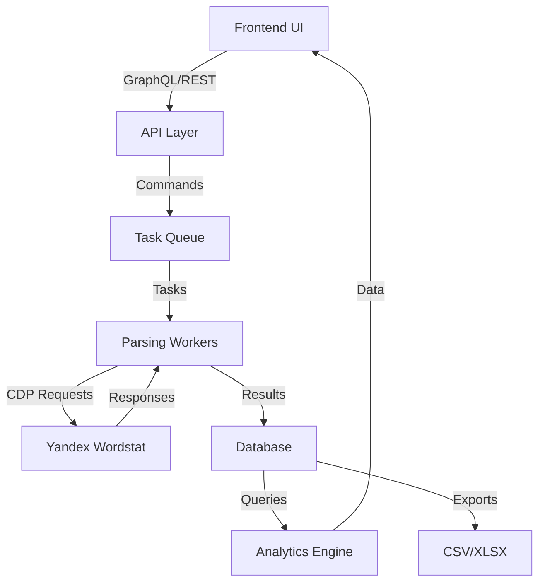
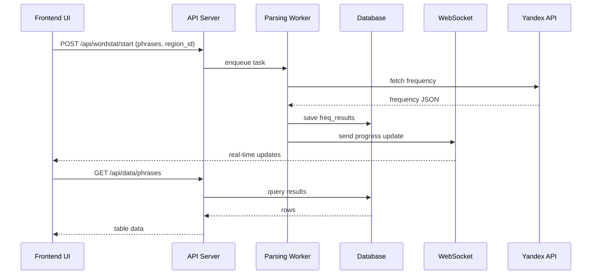
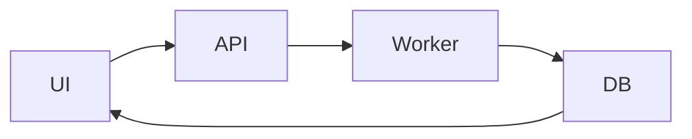

# 11. Потоки данных KeySet-MVP

> **Документация жизненного цикла данных: UI → API → Parser → DB → UI**

## 📋 Содержание

- [Цель](#цель)
- [Для кого](#для-кого)
- [Связанные документы](#связанные-документы)
- [Общая схема потока данных](#общая-схема-потока-данных)
- [Диаграмма последовательности](#диаграмма-последовательности)
- [Основные сценарии](#основные-сценарии)
- [Сниппеты кода](#сниппеты-кода)
- [Типовые ошибки](#типовые-ошибки)
- [Быстрый старт](#быстрый-старт)
- [TL;DR](#tldr)
- [Чек-лист применения](#чек-лист-применения)

---

## Цель

Документация потоков данных KeySet-MVP: от ввода фраз в UI до сохранения результатов в БД и отображения в аналитике.

## Для кого

- Tech Lead для оценки end-to-end потока
- Backend и frontend разработчики
- QA для тестирования сквозных сценариев
- Data analysts для понимания источников данных

## Связанные документы

- [06_PARSING.md](./06_PARSING.md) — парсинг система
- [10_API_INTEGRATION.md](./10_API_INTEGRATION.md) — API интеграция
- [01_DATABASE.md](./01_DATABASE.md) — структура БД
- [09_TABS_OVERVIEW.md](./09_TABS_OVERVIEW.md) — UI модули

---

## Общая схема потока данных



---

## Диаграмма последовательности



---

## Основные сценарии

### 1. Запуск парсинга
- Пользователь вводит список фраз
- Выбирает регион и аккаунты
- UI отправляет запрос `/api/wordstat/start`
- API создаёт задачу в очереди
- Worker распределяет фразы по аккаунтам

### 2. Обработка результатов
- Worker получает ответы от Yandex API
- Парсит JSON и сохраняет данные в таблицу `freq_results`
- Отправляет обновления через WebSocket
- API предоставляет результаты через `/api/data/phrases`

### 3. Аналитика
- Analytics Tab запрашивает агрегированные данные
- Использует показатели для графиков и отчётов

---

## Сниппеты кода

### Постановка задачи парсинга

```python
# файл: keyset/services/multiparser_manager.py:375-397
def create_task(
    self, 
    profile_email: str,
    profile_path: str,
    proxy_uri: Optional[str],
    phrases: List[str]
) -> ParsingTask:
    """Создать новую задачу парсинга"""
    task_id = f"{profile_email}_{datetime.now().strftime('%Y%m%d_%H%M%S')}"
    
    task = ParsingTask(
        task_id=task_id,
        profile_email=profile_email,
        profile_path=Path(profile_path),
        proxy_uri=proxy_uri,
        phrases=phrases
    )
    
    with self._lock:
        self.tasks[task_id] = task
        
    logger.info(f"Created task {task_id} for {profile_email} with {len(phrases)} phrases")
    return task
```

### Сохранение результатов в БД

```python
# файл: backend/db.py:110-138
class FrequencyResult(Base):
    """Frequency parsing result model"""

    __tablename__ = "freq_results"

    # Primary key
    id = Column(Integer, primary_key=True, index=True)

    # Phrase and region
    mask = Column(String(500), nullable=False, index=True)
    region = Column(Integer, nullable=True, index=True)

    # Frequencies
    freq_total = Column(Integer, default=0)  # Broad match (WS)
    freq_quotes = Column(Integer, default=0)  # Phrase match ("WS")
    freq_exact = Column(Integer, default=0)  # Exact match (!WS)

    # Metadata
    group = Column(String(255))  # Group for organization
    status = Column(String(50), default="queued")
    attempts = Column(Integer, default=0)
    error = Column(Text)

    # Timestamps
    created_at = Column(DateTime, default=datetime.utcnow)
    updated_at = Column(DateTime, default=datetime.utcnow, onupdate=datetime.utcnow)

    __table_args__ = (UniqueConstraint("mask", "region", name="uq_mask_region"),)
```

### WebSocket обновление (концепт)

```python
# файл: backend/main.py (пример отправки сообщения)
async def send_parsing_update(websocket: WebSocket, task_id: str, progress: int):
    """Отправить обновление статуса парсинга через WebSocket"""
    message = {
        "type": "parsing_progress",
        "task_id": task_id,
        "progress": progress,
        "timestamp": datetime.utcnow().isoformat()
    }
    await websocket.send_json(message)
```

### Frontend запрос данных

```typescript
// файл: frontend/src/modules/data/api/data.ts:66-80
export function fetchPhrases(params: FetchPhraseParams = {}): Promise<PhraseListResponse> {
  const query = new URLSearchParams();
  if (params.limit) query.set('limit', String(params.limit));
  if (params.offset) query.set('offset', String(params.offset));
  if (params.search) query.set('search', params.search);
  if (params.status) query.set('status', params.status);
  if (params.q) query.set('q', params.q);
  if (params.cursor !== undefined && params.cursor !== null) {
    query.set('cursor', String(params.cursor));
  }
  if (params.sort) query.set('sort', params.sort);

  const suffix = query.toString() ? `?${query.toString()}` : '';
  return request<PhraseListResponse>(`/phrases${suffix}`);
}
```

---

## Типовые ошибки / Как чинить

### ❌ Ошибка: "Data not syncing between tabs"

**Причина:** Нет подписки на WebSocket или Zustand store не обновляется.

**Как чинить:**
1. Проверьте подключение к `ws://localhost:8000/ws` и обрабатывайте события в `useEffect`.
2. Обновляйте store через `useStore.setState` внутри `ws.onmessage`.
3. Добавьте fallback: раз в 30 сек запрашивайте `/api/data/phrases` если WebSocket отключён.

### ❌ Ошибка: "Stale data in analytics"

**Причина:** Кэширование результатов без инвалидирования.

**Как чинить:**
1. Добавьте timestamp последней синхронизации и проверяйте его перед отображением графиков.
2. Сбрасывайте memoized данные в Analytics Module при новом событии WS.
3. В backend добавьте ETag/Last-Modified заголовки для агрегированных эндпоинтов.

### ❌ Ошибка: "Missing region_id in results"

**Причина:** `region_id` не передан до парсинга.

**Как чинить:**
1. На фронте делайте `ensureRegion()` и запрещайте запуск без region.
2. В API требуйте `regions` в `CollectRequest` (валидатор уже приводил к [225]).
3. В worker логируйте payload задачи и заверните сохранение в assert: `assert region_id is not None`.

---

## Быстрый старт

### 1. Трассировка потока данных



### 2. Проверка данных в БД

```sql
SELECT phrase, shows, region_id
FROM freq_results
ORDER BY created_at DESC
LIMIT 20;
```

### 3. Подписка на WebSocket

```typescript
const ws = new WebSocket('ws://localhost:8000/ws');

ws.onmessage = (event) => {
  const data = JSON.parse(event.data);
  updateDataStore(data);
};
```

---

## TL;DR

- **UI → API → Worker → DB → UI** — основной цикл данных
- **WebSocket** — real-time обновления статусов
- **freq_results** — основная таблица результатов
- **region_id** — обязательный параметр для всех записей
- **Zustand** — синхронизация данных между вкладками

---

## Чек-лист применения

- [ ] UI корректно отправляет данные на API
- [ ] API валидирует payload задачи
- [ ] Worker сохраняет результаты в БД
- [ ] WebSocket обновления доходят до UI
- [ ] Analytics получает актуальные данные
- [ ] region_id присутствует в каждой записи
- [ ] Ошибки логируются на всех этапах
- [ ] Тесты покрывают весь поток данных
- [ ] Экспортирует данные в CSV/XLSX
- [ ] Метрики производительности собираются

---

**Последнее обновление:** 2024-11-10

**Следующий шаг:** [12_PRODUCTION_WINDOWS_BUILD.md](./12_PRODUCTION_WINDOWS_BUILD.md) — Production сборка Windows
