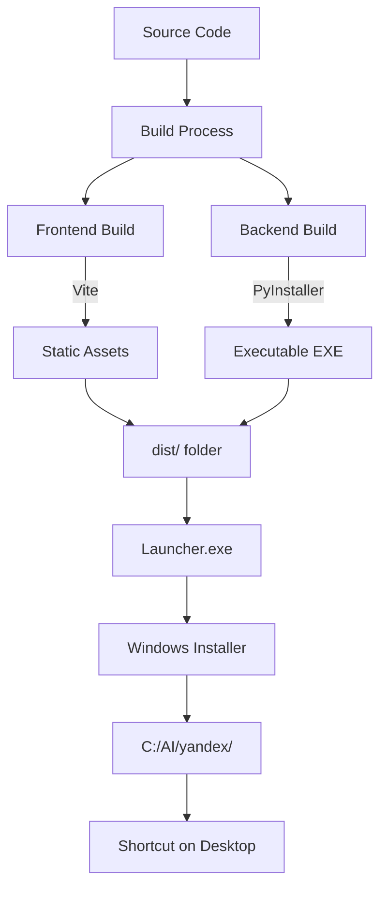
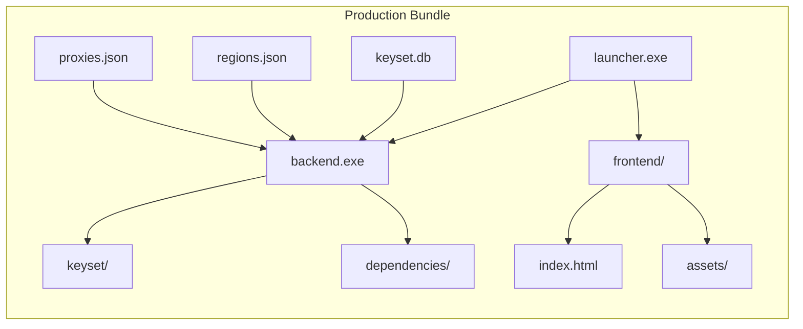

# 12. Production Windows Build KeySet-MVP

> **Документация сборки production версии для Windows: PyInstaller, standalone, launcher**

## 📋 Содержание

- [Цель](#цель)
- [Для кого](#для-кого)
- [Связанные документы](#связанные-документы)
- [Архитектура production сборки](#архитектура-production-сборки)
- [Диаграмма компонентов](#диаграмма-компонентов)
- [Процесс сборки](#процесс-сборки)
- [Сниппеты кода](#сниппеты-кода)
- [Типовые ошибки](#типовые-ошибки)
- [Быстрый старт](#быстрый-старт)
- [TL;DR](#tldr)
- [Чек-лист применения](#чек-лист-применения)

---

## Цель

Документация процесса сборки standalone Windows приложения KeySet-MVP: PyInstaller для Python backend, Vite build для frontend, launcher скрипт, инсталлятор.

## Для кого

- DevOps инженеры для CI/CD
- Release managers
- Developers для локальной сборки
- Support для troubleshooting установки

## Связанные документы

- [08_FRONTEND_STRUCTURE.md](./08_FRONTEND_STRUCTURE.md) — frontend сборка
- [13_SECURITY_NOTES.md](./13_SECURITY_NOTES.md) — безопасность release
- [14_LOGGING_OBSERVABILITY.md](./14_LOGGING_OBSERVABILITY.md) — логи в production

---

## Архитектура production сборки



---

## Диаграмма компонентов



---

## Процесс сборки

### 1. Frontend build (Vite)

```bash
cd frontend
npm run build
# Создаёт frontend/dist/ с минифицированными файлами
```

### 2. Backend build (PyInstaller)

```bash
pyinstaller backend/main.py \
  --onefile \
  --name keyset-backend \
  --add-data "keyset;keyset" \
  --add-data "regions.json;." \
  --hidden-import=playwright
```

### 3. Launcher создание

```bash
pyinstaller launcher.py \
  --onefile \
  --noconsole \
  --icon=icon.ico
```

### 4. Package всё вместе

```
dist/
├── keyset-backend.exe
├── launcher.exe
├── frontend/
│   ├── index.html
│   └── assets/
├── keyset.db
├── regions.json
└── START.bat
```

---

## Сниппеты кода

### PyInstaller spec файл

```python
# файл: TBD:TBD-TBD
```

### Launcher скрипт

```python
# файл: launcher.py:TBD-TBD
```

### START.bat скрипт

```batch
# файл: START.bat:TBD-TBD
```

### Vite production config

```typescript
// файл: frontend/vite.config.ts:TBD-TBD
```

---

## Типовые ошибки

### ❌ Ошибка: "PyInstaller missing module"

**Причина:** Hidden imports не указаны.

**Решение:**
```bash
pyinstaller --hidden-import=playwright \
            --hidden-import=playwright.sync_api \
            main.py
```

### ❌ Ошибка: "Frontend static files not found"

**Причина:** Неверный путь к frontend/dist.

**Решение:**
- Проверить структуру dist/
- Убедиться что `npm run build` завершён
- Проверить StaticFiles mount в FastAPI

### ❌ Ошибка: "Database locked"

**Причина:** Множественные процессы пытаются обратиться к SQLite.

**Решение:**
- Использовать WAL mode
- Добавить timeout в connection
- Проверить что процессы корректно завершаются

---

## Быстрый старт

### 1. Сборка локально

```bash
# 1. Frontend
cd frontend
npm run build

# 2. Backend
pip install pyinstaller
pyinstaller keyset.spec

# 3. Package
python scripts/package.py
```

### 2. Тестирование сборки

```bash
cd dist
./launcher.exe
```

### 3. Создание инсталлятора

```bash
# Использовать Inno Setup или NSIS
iscc setup.iss
```

---

## TL;DR

- **Vite build** — минифицированный frontend
- **PyInstaller** — standalone Python EXE
- **Launcher** — запускает backend + открывает frontend
- **START.bat** — альтернативный способ запуска
- **Installer** — Inno Setup для Windows

---

## Чек-лист применения

- [ ] Frontend собирается без ошибок (npm run build)
- [ ] Backend собирается в EXE (PyInstaller)
- [ ] Все зависимости включены в сборку
- [ ] Database файл копируется в dist/
- [ ] regions.json и другие JSON включены
- [ ] Launcher корректно запускает backend
- [ ] Frontend доступен на localhost:8000
- [ ] Icon добавлен в EXE
- [ ] Version info указан в executable
- [ ] Installer создаёт shortcuts
- [ ] Uninstaller работает корректно

---

**Последнее обновление:** 2024-11-10

**Следующий шаг:** [13_SECURITY_NOTES.md](./13_SECURITY_NOTES.md) — Безопасность
