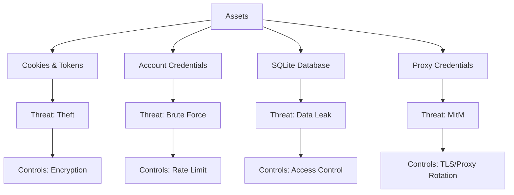
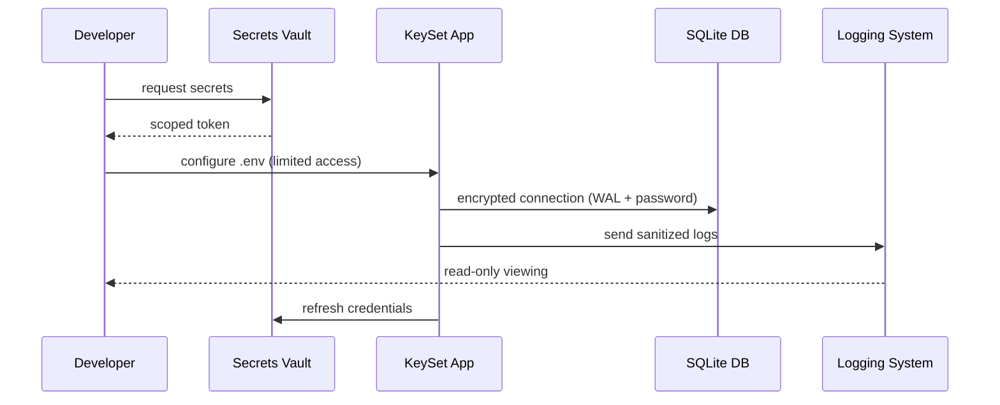

# 13. Security Notes KeySet-MVP

> **Документация по безопасности: хранение данных, доступы, защита окружения**

## 📋 Содержание

- [Цель](#цель)
- [Для кого](#для-кого)
- [Связанные документы](#связанные-документы)
- [Модель угроз](#модель-угроз)
- [Диаграмма безопасности](#диаграмма-безопасности)
- [Контроли безопасности](#контроли-безопасности)
- [Сниппеты](#сниппеты)
- [Типовые ошибки](#типовые-ошибки)
- [Быстрый старт](#быстрый-старт)
- [TL;DR](#tldr)
- [Чек-лист применения](#чек-лист-применения)

---

## Цель

Определить требования безопасности KeySet-MVP: защита аутентификационных данных, контроль доступа к БД, безопасное хранение cookies, управление секретами.

## Для кого

- Security инженеры
- Tech Lead
- Backend разработчики
- DevOps ответственные за инфраструктуру

## Связанные документы

- [02_AUTHENTICATION.md](./02_AUTHENTICATION.md) — cookies и профили
- [04_PROXY_CONNECTIONS.md](./04_PROXY_CONNECTIONS.md) — прокси конфигурации
- [12_PRODUCTION_WINDOWS_BUILD.md](./12_PRODUCTION_WINDOWS_BUILD.md) — production сборка
- [14_LOGGING_OBSERVABILITY.md](./14_LOGGING_OBSERVABILITY.md) — логирование

---

## Модель угроз



---

## Диаграмма безопасности



---

## Контроли безопасности

### 1. Credentials
- Хранить в `.env` с ограниченным доступом
- Не коммитить секреты в репозиторий
- Регулярно ротировать пароли и токены

### 2. Cookies & Profiles
- Шифровать storage_state
- Ограничить доступ к папке `.profiles`
- Использовать DPAPI на Windows для хранения ключей

### 3. Database
- Включить WAL + busy_timeout
- Ограничить доступ к `keyset.db`
- Регулярно делать backup в защищённое хранилище

### 4. Proxy & Network
- Использовать HTTPS/SOCKS5 прокси с авторизацией
- Логировать подключения без раскрытия паролей
- Ограничить список доверенных IP

### 5. Logging
- Редактировать чувствительные данные
- Включить audit trail (кто и когда запускал парсинг)
- Хранить логи не более 30 дней

---

## Сниппеты

### Загрузка секретов из окружения

```python
# файл: backend/main.py:TBD-TBD
```

### Шифрование cookies

```python
# файл: keyset/services/chrome_launcher.py:TBD-TBD
```

### Маскирование логов

```python
# файл: TBD:TBD-TBD
```

### Проверка прав доступа

```python
# файл: backend/routers/accounts.py:TBD-TBD
```

---

## Типовые ошибки

### ❌ Ошибка: "Секреты в репозитории"

**Решение:**
- Проверить `.gitignore`
- Использовать secret scanning
- Ротировать токены при утечке

### ❌ Ошибка: "Открытые порты"

**Решение:**
- Ограничить firewall
- Использовать SSH tunnel или VPN
- Мониторить открытые порты (netstat)

### ❌ Ошибка: "Плоские пароли"

**Решение:**
- Включить сложные пароли
- Поддерживать менеджер паролей
- Хранить хеши паролей

---

## Быстрый старт

### 1. Проверка `.env`

```bash
grep -v '^#' .env | grep -v '^$'
```

### 2. Проверка прав на директории

```bash
icacls C:\AI\yandex\.profiles
```

### 3. Аудит логов

```bash
tail -f logs/security.log
```

---

## TL;DR

- **Секреты** — только в защищённом хранилище
- **Cookies** — шифровать и ограничивать доступ
- **DB** — ограниченный доступ, регулярные backup
- **Proxy** — авторизация и мониторинг
- **Logging** — без чувствительных данных

---

## Чек-лист применения

- [ ] `.env` не в репозитории
- [ ] Папка `.profiles` защищена правами
- [ ] Cookies шифруются при хранении
- [ ] Proxy доступ ограничен и мониторится
- [ ] Логи очищены от чувствительных данных
- [ ] Backup БД настроен и проверяется
- [ ] Секреты ротируются регулярно
- [ ] Security policy задокументирована
- [ ] MFA включен для админских аккаунтов
- [ ] Проведён регулярный security review

---

**Последнее обновление:** 2024-11-10

**Следующий шаг:** [14_LOGGING_OBSERVABILITY.md](./14_LOGGING_OBSERVABILITY.md) — Логирование и наблюдаемость
