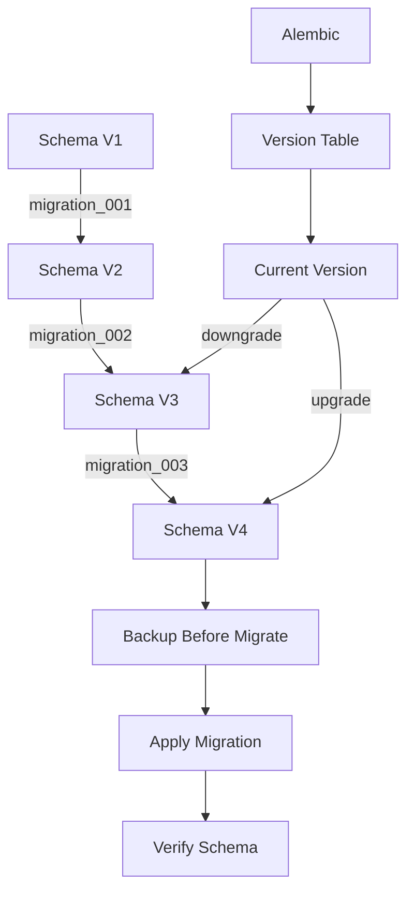
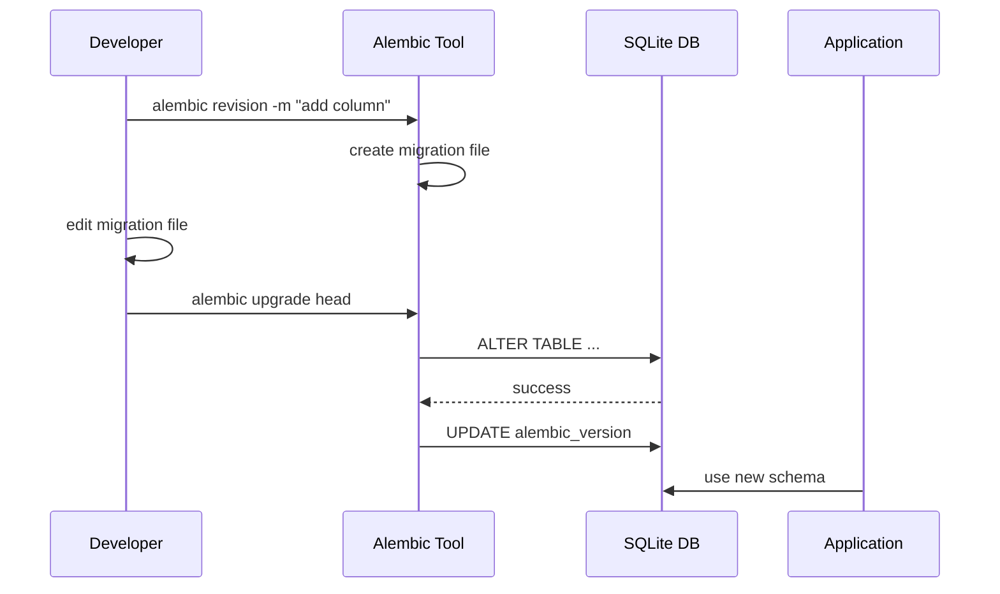

# 15. Migrations & Schema Versioning KeySet-MVP

> **Документация миграций базы данных: SQLite schema changes, Alembic, версионирование**

## 📋 Содержание

- [Цель](#цель)
- [Для кого](#для-кого)
- [Связанные документы](#связанные-документы)
- [Архитектура миграций](#архитектура-миграций)
- [Диаграмма версионирования](#диаграмма-версионирования)
- [Стратегия миграций](#стратегия-миграций)
- [Сниппеты](#сниппеты)
- [Типовые ошибки](#типовые-ошибки)
- [Быстрый старт](#быстрый-старт)
- [TL;DR](#tldr)
- [Чек-лист применения](#чек-лист-применения)

---

## Цель

Документация системы миграций KeySet-MVP: изменения схемы БД, версионирование, откат изменений, совместимость старых данных.

## Для кого

- Backend разработчики для изменения схемы
- DevOps для deployment миграций
- Database администраторы
- QA для тестирования миграций

## Связанные документы

- [01_DATABASE.md](./01_DATABASE.md) — структура БД
- [12_PRODUCTION_WINDOWS_BUILD.md](./12_PRODUCTION_WINDOWS_BUILD.md) — миграции в production
- [13_SECURITY_NOTES.md](./13_SECURITY_NOTES.md) — безопасность данных

---

## Архитектура миграций



---

## Диаграмма версионирования



---

## Стратегия миграций

### 1. Изменения схемы
- Используем Alembic для миграций
- Каждое изменение — отдельная миграция
- Версионирование через git

### 2. Совместимость
- Backward compatibility для 1 версии назад
- Deprecated поля помечаем комментариями
- Data migration отдельно от schema migration

### 3. Тестирование
- Тестируем upgrade и downgrade
- Проверяем на тестовой копии БД
- Rollback план для критических изменений

### 4. Production deployment
- Backup БД перед миграцией
- Миграции в maintenance window
- Мониторинг после применения

---

## Сниппеты

### Инициализация Alembic

```bash
# файл: TBD:TBD-TBD
```

### Создание миграции

```python
# файл: TBD:TBD-TBD
```

### Применение миграции

```python
# файл: backend/db.py:TBD-TBD
```

### Rollback миграции

```python
# файл: TBD:TBD-TBD
```

### Data migration пример

```python
# файл: TBD:TBD-TBD
```

---

## Типовые ошибки

### ❌ Ошибка: "Alembic version mismatch"

**Причина:** БД на старой версии, код требует новую.

**Решение:**
```bash
alembic upgrade head
```

### ❌ Ошибка: "Migration failed halfway"

**Причина:** Ошибка в migration скрипте.

**Решение:**
- Откатить на backup
- Исправить migration файл
- Применить снова с тестами

### ❌ Ошибка: "SQLite locked during migration"

**Причина:** Другой процесс держит lock на БД.

**Решение:**
- Остановить приложение
- Убедиться что connections закрыты
- Включить WAL mode

---

## Быстрый старт

### 1. Инициализация Alembic

```bash
cd backend
alembic init alembic
```

### 2. Настройка alembic.ini

```ini
sqlalchemy.url = sqlite:///keyset.db
```

### 3. Создание первой миграции

```bash
alembic revision -m "initial schema"
```

### 4. Редактирование миграции

```python
def upgrade():
    op.create_table(
        'accounts',
        sa.Column('id', sa.Integer, primary_key=True),
        sa.Column('name', sa.String(255)),
    )

def downgrade():
    op.drop_table('accounts')
```

### 5. Применение миграции

```bash
alembic upgrade head
```

### 6. Откат миграции

```bash
alembic downgrade -1
```

---

## TL;DR

- **Alembic** — инструмент для миграций
- **Версионирование** — каждое изменение схемы
- **Backward compatibility** — 1 версия назад
- **Backup** — перед каждой миграцией
- **Тестирование** — upgrade и downgrade

---

## Чек-лист применения

- [ ] Alembic инициализирован в проекте
- [ ] alembic.ini настроен корректно
- [ ] Все изменения схемы через миграции
- [ ] Миграции версионированы в git
- [ ] Тесты для upgrade и downgrade
- [ ] Backup БД перед миграцией
- [ ] Rollback план задокументирован
- [ ] Data migrations отдельно от schema
- [ ] Production миграции в maintenance window
- [ ] Мониторинг после миграции настроен

---

**Последнее обновление:** 2024-11-10

**Следующий шаг:** Вернуться к [ARCHITECTURE_INDEX.md](./ARCHITECTURE_INDEX.md)
