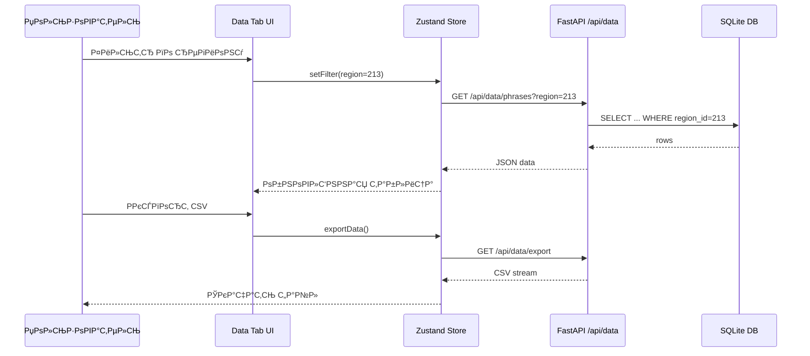

# 05. Реабилитация вкладки «Данные»

> **Документация восстановления Data Tab: структура таблицы, потоки данных, UX паттерны**

## 📋 Содержание

- [Цель](#цель)
- [Для кого](#для-кого)
- [Связанные документы](#связанные-документы)
- [Архитектура вкладки](#архитектура-вкладки)
- [Диаграмма взаимодействия](#диаграмма-взаимодействия)
- [Компоненты интерфейса](#компоненты-интерфейса)
- [Сниппеты](#сниппеты)
- [Типовые ошибки](#типовые-ошибки)
- [Быстрый старт](#быстрый-старт)
- [TL;DR](#tldr)
- [Чек-лист применения](#чек-лист-применения)
- [Последнее обновление](#последнее-обновление)

---

## Цель

Описать восстановленную архитектуру вкладки «Данные»: загрузка фраз, фильтрация, редактирование и синхронизация с backend.

## Для кого

- Frontend разработчики (React/Zustand)
- Backend разработчики, поддерживающие API `/api/data`
- QA, проверяющие граничные сценарии
- Аналитики, работающие с выгрузкой данных

## Связанные документы

- [09_TABS_OVERVIEW.md](./09_TABS_OVERVIEW.md) — обзор всех вкладок приложения
- [10_API_INTEGRATION.md](./10_API_INTEGRATION.md) — эндпоинты `/api/data` и интеграция с backend
- [11_DATA_FLOW.md](./11_DATA_FLOW.md) — поток данных UI ↔ API ↔ БД и real-time обновления

---

## Архитектура вкладки

```mermaid
graph TD
    A[DataTabLayout] --> B[Toolbar]
    A --> C[DataTable]
    A --> D[FiltersPanel]

    B --> E[Import CSV]
    B --> F[Export]
    B --> G[Bulk Actions]

    C --> H[Zustand dataStore]
    D --> H

    H -->|fetch| I[/api/data/phrases]
    H -->|mutations| J[/api/data/bulk]

    I --> K[SQLite freq_results]
    J --> K
```

---

## Диаграмма взаимодействия



---

## Компоненты интерфейса

1. **Toolbar** — импорт CSV, экспорт, массовые действия
2. **FiltersPanel** — фильтры по региону, тегам, датам
3. **DataTable** — таблица фраз и метрик
4. **DetailsDrawer** — подробности по фразе (при наличии)
5. **Notifications** — успех/ошибка операций

---

## Сниппеты

### DataTab компонент

```typescript
// файл: frontend/src/modules/data/App.tsx:TBD-TBD
```

### Селектор данных из store

```typescript
// файл: frontend/src/modules/data/store/useStore.ts:TBD-TBD
```

### API слой для данных

```typescript
// файл: frontend/src/modules/data/api/data.ts:TBD-TBD
```

### Р­РєСЃРїРѕСЂС‚ CSV РЅР° backend

```python
# файл: backend/routers/data.py:TBD-TBD
```

---

## Типовые ошибки

### ❌ Ошибка: «Фразы не подгружаются»

**Причина:** Некорректная синхронизация фильтров → API.

**Решение:**
- Проверить сериализацию параметров запроса
- Убедиться что backend поддерживает фильтр
- Логировать payload перед запросом

### ❌ Ошибка: «Экспорт пустой»

**Причина:** Состояние store не содержит актуальных данных.

**Решение:**
- Перед экспортом вызвать `fetchPhrases`
- Проверить фильтры (region, tags)
- Убедиться что API возвращает строки

### ❌ Ошибка: «Несогласованность данных»

**Причина:** Отсутствует обновление store после мутации.

**Решение:**
- После POST/DELETE вызвать `refresh`
- Использовать оптимистичное обновление с откатом
- Добавить WebSocket синхронизацию (если доступно)

---

## Быстрый старт

### 1. Загрузка данных при монтировании

```typescript
useEffect(() => {
  fetchPhrases();
}, [fetchPhrases]);
```

### 2. Применение фильтра

```typescript
setFilters((prev) => ({
  ...prev,
  regionId: selectedRegion,
}));
```

### 3. Р­РєСЃРїРѕСЂС‚

```typescript
await exportPhrases({ format: 'csv', regionId });
```

---

## TL;DR

- Вкладка «Данные» использует Zustand store + React таблицу
- Фильтры синхронизируются с API параметрами
- Экспорт данных доступен в CSV/Excel
- После мутаций требуется обновление store

---

## Чек-лист применения

- [ ] Загрузка данных с сервера работает
- [ ] Фильтрация по региону и тегам корректна
- [ ] Импорт/экспорт CSV протестирован
- [ ] Массовые операции обновляют таблицу
- [ ] Ошибки отображаются через notifications
- [ ] WebSocket обновляет изменения (если включён)
- [ ] Переключение вкладок сохраняет state

---

## Последнее обновление

- **Дата:** 2024-11-10
- **Ответственный:** TBD
