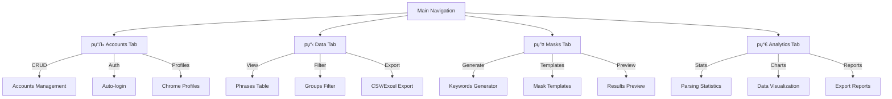
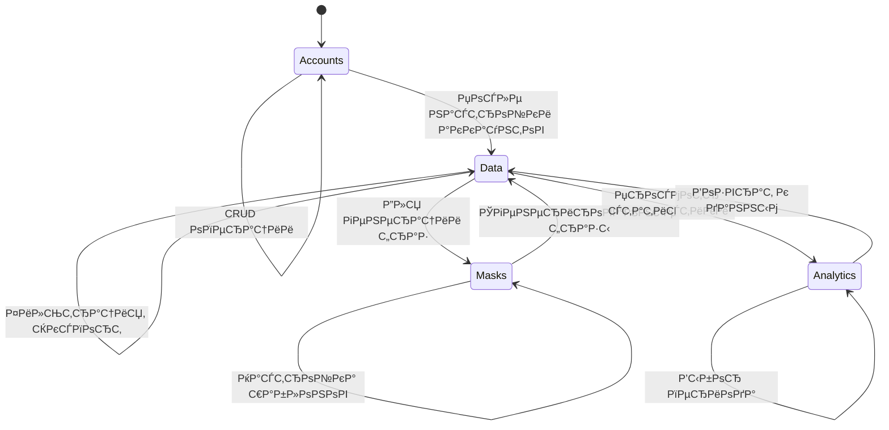

# 09. Обзор вкладок KeySet-MVP

> **Документация UI модулей: Аккаунты, Данные, Маски, Аналитика**

## 📋 Содержание

- [Цель](#цель)
- [Для кого](#для-кого)
- [Связанные документы](#связанные-документы)
- [Архитектура вкладок](#архитектура-вкладок)
- [Диаграмма навигации](#диаграмма-навигации)
- [Модули и функционал](#модули-и-функционал)
- [Сниппеты кода](#сниппеты-кода)
- [Типовые ошибки](#типовые-ошибки)
- [Быстрый старт](#быстрый-старт)
- [TL;DR](#tldr)
- [Чек-лист применения](#чек-лист-применения)

---

## Цель

Документация UI модулей KeySet-MVP: обзор функционала каждой вкладки, взаимодействие между модулями, компоненты и их назначение.

## Для кого

- Frontend разработчики для понимания структуры UI
- Product managers для feature mapping
- QA для тестирования функционала
- UX дизайнеры для улучшения интерфейса

## Связанные документы

- [08_FRONTEND_STRUCTURE.md](./08_FRONTEND_STRUCTURE.md) — архитектура frontend
- [10_API_INTEGRATION.md](./10_API_INTEGRATION.md) — API эндпоинты
- [11_DATA_FLOW.md](./11_DATA_FLOW.md) — потоки данных

---

## Архитектура вкладок



---

## Диаграмма навигации



---

## Модули и функционал

### 1. 📊 Accounts Tab (Аккаунты)

**Назначение:** Управление Yandex аккаунтами для парсинга

**Функционал:**
- Добавление/удаление аккаунтов
- Авто-логин через Chrome profiles
- Настройка прокси для аккаунтов
- Статусы: ok/cooldown/captcha/banned
- Тестирование подключения

### 2. 📋 Data Tab (Данные)

**Назначение:** Просмотр и управление спарсенными фразами

**Функционал:**
- Таблица всех фраз с показателями
- Группировка по категориям
- Фильтрация по региону, дате, группе
- Р­РєСЃРїРѕСЂС‚ РІ CSV/Excel
- Массовое удаление

### 3. 🔤 Masks Tab (Маски)

**Назначение:** Генерация ключевых слов по шаблонам

**Функционал:**
- Создание масок (шаблонов)
- Подстановка переменных
- Генерация комбинаций
- Preview результатов
- Экспорт списка фраз

### 4. 📈 Analytics Tab (Аналитика)

**Назначение:** Статистика и визуализация данных

**Функционал:**
- Графики парсинга по времени
- Топ фраз по показам
- Статистика по регионам
- Производительность аккаунтов
- Экспорт отчетов

---

## Сниппеты кода

### Accounts Module

```typescript
// файл: frontend/src/modules/accounts/index.tsx:26-41
const loadAccounts = useCallback(async () => {
  setIsLoading(true);
  setError(null);
  try {
    const data = await fetchAccounts();
    setAccounts(data);
  } catch (loadError) {
    setAccounts([]);
    setError(
      (loadError as Error).message ||
        "Не удалось загрузить аккаунты. Проверьте backend."
    );
  } finally {
    setIsLoading(false);
  }
}, []);
```

### Data Module

```typescript
// файл: frontend/src/modules/data/App.tsx:63-84
const { 
  selectedPhraseIds, 
  phrases,
  groups,
  clearFilters,
  deletePhrases, 
  selectAll, 
  deselectAll,
  invertSelection,
  undo,
  redo,
  canUndo,
  canRedo,
  addLog,
  movePhrasesToGroup,
  copyPhrasesToGroup,
  updateGroupParent,
  loadInitialData,
  isDataLoaded,
  isDataLoading,
  dataError,
} = useStore();
```

### Masks Module (генератор)

```typescript
// файл: frontend/src/modules/masks/lib/stream-generator.ts:25-50 (упрощено)
export async function* generateStream(
  template: string,
  options: GeneratorOptions
): AsyncGenerator<GeneratedPhrase> {
  const lines = template.split('\\n').filter(l => l.trim());
  let counter = 0;
  
  for (const line of lines) {
    // Обработка шаблона с подстановками
    const processed = processTemplate(line, options);
    
    for (const variant of processed) {
      yield {
        id: `${Date.now()}-${counter++}`,
        text: variant,
        source: 'mask-generator'
      };
      
      // Пауза для избежания блокировки UI
      if (counter % 100 === 0) {
        await new Promise(r => setTimeout(r, 0));
      }
    }
  }
}
```

### Analytics Module

```typescript
// файл: frontend/src/modules/analytics/App.tsx (концепт — модуль находится в разработке)
// Пример структуры:
export default function AnalyticsModule() {
  const [stats, setStats] = useState<ParsingStats | null>(null);
  
  useEffect(() => {
    fetchParsingStatistics().then(setStats);
  }, []);
  
  return (
    <div>
      <h1>Статистика парсинга</h1>
      {stats && <StatsChart data={stats} />}
    </div>
  );
}
```

---

## Типовые ошибки / Как чинить

### ❌ Ошибка: "Table not rendering data"

**Причина:** Zustand store не загружен или данные ещё не готовы.

**Как чинить:**
1. Убедитесь, что `loadInitialData()` вызывается в `useEffect` при монтировании Data модуля.
2. Показывайте `Loader2` (см. `App.tsx`) пока `isDataLoading === true`.
3. Логируйте `dataError` и отображайте его в `StatusBar`.

### ❌ Ошибка: "Filter not working"

**Причина:** State не обновляется или фильтр применяется к неверному полю.

**Как чинить:**
1. Проверьте селекторы в `useStore` — фильтры должны обновлять `filters` внутри Zustand.
2. Используйте `useMemo` и функции `filterAccounts`/`applyFilters` для чистых вычислений.
3. Добавьте debounce (например, `useDebounce`) для текстовых инпутов, чтобы предотвратить лишние ререндеры.

### ❌ Ошибка: "Export produces empty file"

**Причина:** Экспорт запускается до загрузки данных или не выбраны строки.

**Как чинить:**
1. Перед экспортом проверяйте `phrases.length` и выводите предупреждение через `addLog('warning', ...)`.
2. Для массового экспорта используйте `MassBulkPanel` — он проверяет выделенные строки.
3. Убедитесь, что `exportToCSV` получает чистый массив объектов (без `Set`/`Map`).

---

## Быстрый старт

### 1. Навигация между вкладками

```typescript
import { useNavigate } from 'react-router-dom';

const navigate = useNavigate();

// Переход на вкладку Data
navigate('/data');
```

### 2. Загрузка данных модуля

```typescript
import { useDataStore } from '@/stores/dataStore';

const { phrases, fetchPhrases } = useDataStore();

useEffect(() => {
  fetchPhrases();
}, []);
```

### 3. Экспорт данных

```typescript
import { exportToCSV } from '@/lib/export';

const handleExport = () => {
  exportToCSV(phrases, 'phrases.csv');
};
```

---

## TL;DR

- **Accounts** — управление Yandex аккаунтами
- **Data** — просмотр и фильтрация фраз
- **Masks** — генерация ключевых слов
- **Analytics** — статистика и отчеты
- **React Router** — навигация между модулями
- **Zustand** — state для каждого модуля

---

## Чек-лист применения

- [ ] Все 4 модуля доступны в навигации
- [ ] Accounts: CRUD операции работают
- [ ] Accounts: Auto-login настроен
- [ ] Data: Таблица отображает фразы
- [ ] Data: Фильтры применяются
- [ ] Data: Экспорт в CSV/Excel работает
- [ ] Masks: Генерация по шаблонам
- [ ] Masks: Preview показывает результат
- [ ] Analytics: Графики отображаются
- [ ] Analytics: Экспорт отчетов работает

---

**Последнее обновление:** 2024-11-10

**Следующий шаг:** [10_API_INTEGRATION.md](./10_API_INTEGRATION.md) — API интеграция
