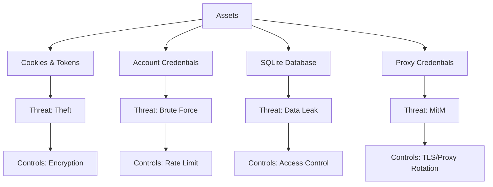
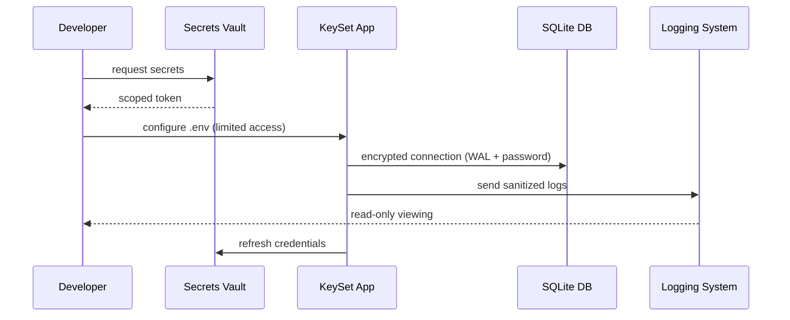

# 13. Security Notes KeySet-MVP

> **Документация по безопасности: хранение данных, доступы, защита окружения**

## 📋 Содержание

- [Цель](#цель)
- [Для кого](#для-кого)
- [Связанные документы](#связанные-документы)
- [Модель угроз](#модель-угроз)
- [Диаграмма безопасности](#диаграмма-безопасности)
- [Контроли безопасности](#контроли-безопасности)
- [Сниппеты](#сниппеты)
- [Типовые ошибки](#типовые-ошибки)
- [Быстрый старт](#быстрый-старт)
- [TL;DR](#tldr)
- [Чек-лист применения](#чек-лист-применения)

---

## Цель

Определить требования безопасности KeySet-MVP: защита аутентификационных данных, контроль доступа к БД, безопасное хранение cookies, управление секретами.

## Для кого

- Security инженеры
- Tech Lead
- Backend разработчики
- DevOps ответственные за инфраструктуру

## Связанные документы

- [02_AUTHENTICATION.md](./02_AUTHENTICATION.md) — cookies и профили
- [04_PROXY_CONNECTIONS.md](./04_PROXY_CONNECTIONS.md) — прокси конфигурации
- [12_PRODUCTION_WINDOWS_BUILD.md](./12_PRODUCTION_WINDOWS_BUILD.md) — production сборка
- [14_LOGGING_OBSERVABILITY.md](./14_LOGGING_OBSERVABILITY.md) — логирование

---

## Модель угроз



---

## Диаграмма безопасности



---

## Контроли безопасности

### 1. Credentials (пароли, токены)
- Хранить в `.env` с правами `600` (только владелец).
- **Никогда** не коммитить секреты в Git (`git-secrets` hook).
- Ротировать каптча-ключи и Yandex токены минимум раз в 90 дней.

### 2. Cookies & Profiles (DPAPI)
- Шифровать куки Windows DPAPI (`win32crypt.CryptUnprotectData`).
- Ограничить доступ к `C:\AI\yandex\.profiles` — только текущий пользователь (ACL).
- Никогда не передавать `encrypted_value` по сети без TLS.

### 3. Database (SQLite)
- Включить WAL режим: `PRAGMA journal_mode=WAL; PRAGMA busy_timeout=30000;`.
- Ограничить доступ к `keyset.db` (ACL, только локальный owner).
- Ежедневный backup в шифрованный архив (AES-256) во внешнее хранилище.

### 4. Proxy & Network (маскирование)
- Используйте HTTPS/SOCKS5 прокси с аутентификацией.
- В логах маскируйте пароли: `f"Proxy: {proxy[:10]}...{proxy[-4:]}"`.
- Ограничьте trusted_hosts в production (whitelist IP).

### 5. Logging (чувствительные данные)
- Экранируйте cookies, passwords, apiKey перед записью.
- Audit trail: кто запустил парсинг, когда, какой region_id.
- Ротация логов: раз в 30 дней удаляйте старые файлы (logrotate / Task Scheduler).

### 6. Ротация ключей (actionable)
1. **Антикапча/ProxyAPI**: раз в 3 месяца генерировать новые API-токены, обновлять `.env`.
2. **Chrome profiles**: если cookies утекли — сбросить сессии Yandex, пересоздать профиль.
3. **DB secrets**: при утечке `keyset.db` — обнулить столбец `Account.cookies`, переавторизовать аккаунты.

### 7. Chek-лист перед production
- [ ] `.env` вне Git и папка `.profiles` с ACL owner-only.
- [ ] DPAPI корректно дешифрует куки (тест на чистой VM).
- [ ] Логи без raw cookies и паролей.
- [ ] DB-бэкапы шифрованы и автоматизированы.
- [ ] Proxy credentials хранятся в encrypted секции конфига.
- [ ] Все API ключи задокументированы и ротируются по графику.
- [ ] Pre-commit hooks блокируют коммиты с секретами.
- [ ] Инструкция по security incident response готова.

---

## Сниппеты

### DPAPI расшифровка cookies

```python
# файл: keyset/services/multiparser_manager.py:63-91
def _get_chrome_master_key(profile_path: Path, logger_obj: logging.Logger) -> Optional[bytes]:
    resolved_path = profile_path.resolve()
    if resolved_path in _MASTER_KEY_CACHE:
        return _MASTER_KEY_CACHE[resolved_path]

    local_state_path = resolved_path / "Local State"
    if not local_state_path.exists():
        _MASTER_KEY_CACHE[resolved_path] = None
        return None

    try:
        data = json.loads(local_state_path.read_text(encoding="utf-8"))
        encrypted_key_b64 = data.get("os_crypt", {}).get("encrypted_key")
        if not encrypted_key_b64:
            _MASTER_KEY_CACHE[resolved_path] = None
            return None
        encrypted_key = base64.b64decode(encrypted_key_b64)
        if encrypted_key.startswith(b"DPAPI"):
            encrypted_key = encrypted_key[5:]
        master_key = win32crypt.CryptUnprotectData(encrypted_key, None, None, None, 0)[1]
        _MASTER_KEY_CACHE[resolved_path] = master_key
        return master_key
    except Exception as exc:
        logger_obj.warning(f"[{profile_path.name}] Не удалось получить мастер-ключ Chrome: {exc}")
        _MASTER_KEY_CACHE[resolved_path] = None
        return None
```

### Шифрование proxy и cookies

```python
# файл: keyset/services/multiparser_manager.py:94-118
def _decrypt_chrome_value(
    encrypted_value: bytes,
    profile_path: Path,
    logger_obj: logging.Logger,
    master_key: Optional[bytes],
) -> str:
    if not encrypted_value:
        return ""
    try:
        if encrypted_value.startswith(b'v10') or encrypted_value.startswith(b'v11'):
            if not AESGCM_AVAILABLE:
                return ""
            if not master_key:
                master_key = _get_chrome_master_key(profile_path, logger_obj)
                if not master_key:
                    return ""
            nonce = encrypted_value[3:15]
            ciphertext = encrypted_value[15:-16]
            tag = encrypted_value[-16:]
            aesgcm = AESGCM(master_key)
            decrypted = aesgcm.decrypt(nonce, ciphertext + tag, None)
        else:
            decrypted = win32crypt.CryptUnprotectData(encrypted_value, None, None, None, 0)[1]
        return decrypted.decode("utf-8", errors="ignore")
    except Exception:
        return ""
```

### Маскирование логов

```python
# файл: keyset/services/multiparser_manager.py:48-58
logging.basicConfig(
    level=logging.INFO,
    format='%(asctime)s - %(name)s - %(levelname)s - %(message)s',
    handlers=[
        logging.FileHandler(str(LOG_DIR / 'multiparser.log'), encoding='utf-8'),
        logging.StreamHandler()
    ]
)

# Пример маскировки
proxy_value = proxy if len(proxy) < 16 else f"{proxy[:10]}...{proxy[-4:]}"
logger.info(f"[{account_name}] proxy={proxy_value}")
```

### Проверка прав доступа к профилю

```python
# файл: keyset/services/multiparser_manager.py:124-150
candidates = [
    profile_path / "Default" / "Network" / "Cookies",
    profile_path / "Default" / "Cookies",
    profile_path / "Cookies",
    profile_path / "Network" / "Cookies",
]
source_path: Optional[Path] = None
for candidate in candidates:
    if candidate.exists():
        source_path = candidate
        break

if not source_path:
    logger_obj.info(f"[{profile_path.name}] Файл Cookies не найден в профиле")
    return []
```

---

## Типовые ошибки / Как чинить

### ❌ Ошибка: "Секреты в репозитории"

**Причина:** В Git попал файл `.env` или логи с plain-text токенами.

**Как чинить:**
1. Немедленно ротируйте все ключи (антикапча, прокси API).
2. Убедитесь, что `.gitignore` содержит `.env`, `*.log`, `.profiles/`.
3. Установите pre-commit hook: `git-secrets --install` и добавьте правила для паттернов (`APIKEY=...`).

### ❌ Ошибка: "Открытые порты"

**Причина:** Backend слушает `0.0.0.0:8765` вместо `127.0.0.1`.

**Как чинить:**
1. В `launcher.py` замените `BACKEND_HOST = "0.0.0.0"` на `"127.0.0.1"`.
2. Настройте Windows Firewall для блокировки входящих соединений на порт 8765 (кроме localhost).
3. Для remote-доступа используйте SSH tunnel: `ssh -L 8765:127.0.0.1:8765 user@server`.

### ❌ Ошибка: "DPAPI не расшифровывает куки"

**Причина:** Профиль создан другим Windows-пользователем.

**Как чинить:**
1. Убедитесь, что аккаунт запускает launcher под тем же Windows user, который создал Chrome profile.
2. Если пересоздали пользователя — скопируйте профиль заново и пересоберите `_MASTER_KEY_CACHE`.
3. Проверьте `Local State` в профиле — убедитесь, что `os_crypt.encrypted_key` существует и корректный.

---

## Быстрый старт

### 1. Проверка `.env`

```bash
grep -v '^#' .env | grep -v '^$'
```

### 2. Проверка прав на директории

```bash
icacls C:\AI\yandex\.profiles
```

### 3. Аудит логов

```bash
tail -f logs/security.log
```

---

## TL;DR

- **Секреты** — только в защищённом хранилище
- **Cookies** — шифровать и ограничивать доступ
- **DB** — ограниченный доступ, регулярные backup
- **Proxy** — авторизация и мониторинг
- **Logging** — без чувствительных данных

---

## Чек-лист применения

- [ ] `.env` не в репозитории
- [ ] Папка `.profiles` защищена правами
- [ ] Cookies шифруются при хранении
- [ ] Proxy доступ ограничен и мониторится
- [ ] Логи очищены от чувствительных данных
- [ ] Backup БД настроен и проверяется
- [ ] Секреты ротируются регулярно
- [ ] Security policy задокументирована
- [ ] MFA включен для админских аккаунтов
- [ ] Проведён регулярный security review

---

**Последнее обновление:** 2024-11-10

**Следующий шаг:** [14_LOGGING_OBSERVABILITY.md](./14_LOGGING_OBSERVABILITY.md) — Логирование и наблюдаемость
