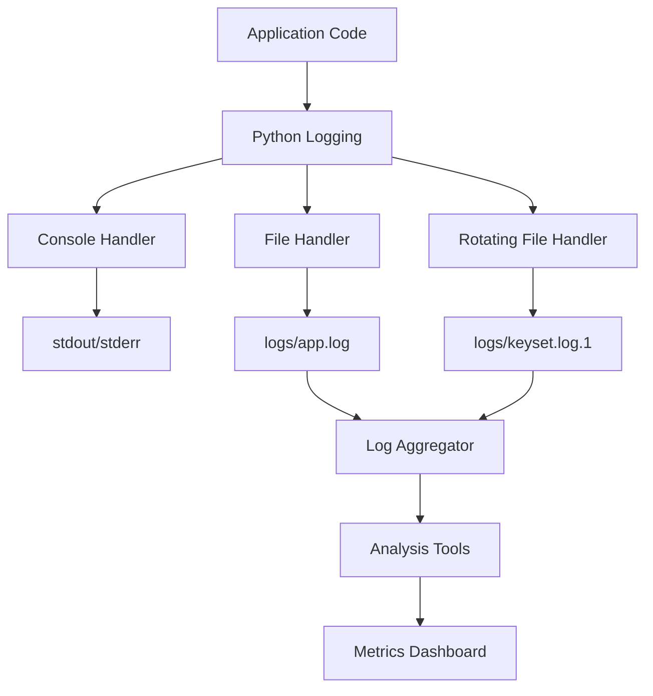
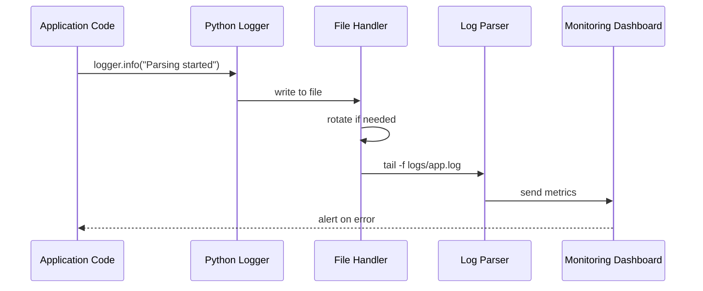

# 14. Logging & Observability KeySet-MVP

> **Документация системы логирования и мониторинга: Python logging, metrics, debugging**

## 📋 Содержание

- [Цель](#цель)
- [Для кого](#для-кого)
- [Связанные документы](#связанные-документы)
- [Архитектура логирования](#архитектура-логирования)
- [Диаграмма потоков логов](#диаграмма-потоков-логов)
- [Уровни логирования](#уровни-логирования)
- [Сниппеты](#сниппеты)
- [Типовые ошибки](#типовые-ошибки)
- [Быстрый старт](#быстрый-старт)
- [TL;DR](#tldr)
- [Чек-лист применения](#чек-лист-применения)

---

## Цель

Документация системы логирования KeySet-MVP: структурированные логи, мониторинг производительности, debugging парсера, анализ ошибок.

## Для кого

- Backend разработчики для debugging
- DevOps для мониторинга в production
- QA для анализа багов
- Support для помощи пользователям

## Связанные документы

- [06_PARSING.md](./06_PARSING.md) — логи парсера
- [13_SECURITY_NOTES.md](./13_SECURITY_NOTES.md) — безопасность логов
- [12_PRODUCTION_WINDOWS_BUILD.md](./12_PRODUCTION_WINDOWS_BUILD.md) — логи в production

---

## Архитектура логирования



---

## Диаграмма потоков логов



---

## Уровни логирования

| Уровень | Применение | Пример |
|---------|-----------|--------|
| DEBUG | Детальная информация для debugging | "Phrase queue: 523 items" |
| INFO | Обычный ход работы | "Parsing started for account X" |
| WARNING | Потенциальные проблемы | "Proxy slow response time: 3s" |
| ERROR | Ошибки требующие внимания | "CDP session failed for tab 5" |
| CRITICAL | Критические ошибки | "Database connection lost" |

---

## Сниппеты

### Настройка логирования

```python
# файл: TBD:TBD-TBD
```

### Logger в парсере

```python
# файл: keyset/workers/turbo_parser_working.py:TBD-TBD
```

### Rotation handler

```python
# файл: backend/main.py:TBD-TBD
```

### Structured logging

```python
# файл: TBD:TBD-TBD
```

### Metrics СЃР±РѕСЂ

```python
# файл: TBD:TBD-TBD
```

---

## Типовые ошибки

### ❌ Ошибка: "Логи захламлены DEBUG сообщениями"

**Решение:**
```python
logging.basicConfig(level=logging.INFO)  # или WARNING для production
```

### ❌ Ошибка: "Логи не ротируются"

**Решение:**
```python
from logging.handlers import RotatingFileHandler

handler = RotatingFileHandler(
    'logs/app.log',
    maxBytes=10*1024*1024,  # 10 MB
    backupCount=5
)
```

### ❌ Ошибка: "Чувствительные данные в логах"

**Решение:**
```python
def sanitize_log(message: str) -> str:
    # Маскировать пароли, токены, cookies
    return re.sub(r'password=\S+', 'password=***', message)
```

---

## Быстрый старт

### 1. Инициализация логирования

```python
import logging

logger = logging.getLogger(__name__)
logger.setLevel(logging.INFO)

handler = logging.FileHandler('logs/app.log')
formatter = logging.Formatter(
    '%(asctime)s - %(name)s - %(levelname)s - %(message)s'
)
handler.setFormatter(formatter)
logger.addHandler(handler)
```

### 2. Использование в коде

```python
logger.info("Parsing started for phrase: %s", phrase)
logger.warning("Proxy timeout exceeded")
logger.error("Failed to parse phrase: %s", phrase, exc_info=True)
```

### 3. Просмотр логов

```bash
# Tail логов в реальном времени
tail -f logs/app.log

# Фильтрация ошибок
grep ERROR logs/app.log

# Подсчёт ошибок
grep -c ERROR logs/app.log
```

---

## TL;DR

- **Python logging** — стандартная библиотека
- **Rotation** — автоматическая ротация файлов
- **Structured logs** — JSON формат для парсинга
- **Metrics** — производительность и ошибки
- **Sanitization** — очистка чувствительных данных

---

## Чек-лист применения

- [ ] Logging настроен на всех уровнях приложения
- [ ] Уровень логов настроен (DEBUG/INFO/WARNING)
- [ ] Rotation handler настроен (maxBytes, backupCount)
- [ ] Чувствительные данные маскируются
- [ ] Structured logging (JSON) включён
- [ ] Логи парсера включают context (account, phrase, region)
- [ ] Error tracking интегрирован
- [ ] Metrics собираются (парсинг rate, errors)
- [ ] Мониторинг настроен для критических ошибок
- [ ] Логи архивируются и очищаются регулярно

---

**Последнее обновление:** 2024-11-10

**Следующий шаг:** [15_MIGRATIONS_AND_SCHEMA_VERSIONING.md](./15_MIGRATIONS_AND_SCHEMA_VERSIONING.md) — Миграции БД
