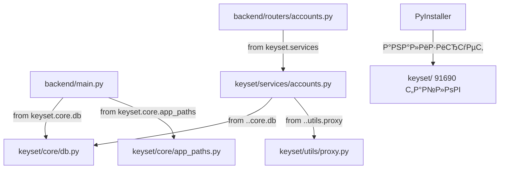
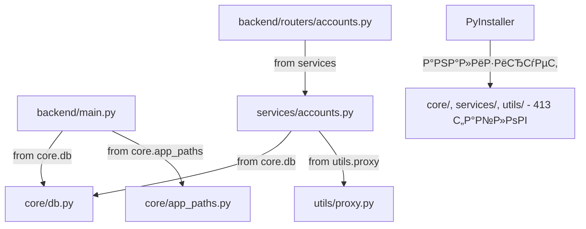

# 17. Консолидация модульной структуры KeySet-MVP

> **Документация переноса модулей из keyset/ в плоскую структуру: core/, services/, utils/**

## 📋 Содержание

- [Цель](#цель)
- [Для кого](#для-кого)
- [Связанные документы](#связанные-документы)
- [Проблема и решение](#проблема-и-решение)
- [Архитектура до и после](#архитектура-до-и-после)
- [Изменения импортов](#изменения-импортов)
- [Сниппеты кода](#сниппеты-кода)
- [Типовые ошибки](#типовые-ошибки)
- [Быстрый старт](#быстрый-старт)
- [TL;DR](#tldr)
- [Чек-лист применения](#чек-лист-применения)

---

## Цель

Документация процесса консолидации модулей из вложенной структуры `keyset/` в плоскую структуру `core/`, `services/`, `utils/` на уровне корня проекта для упрощения сборки и устранения дублирования кода.

## Для кого

- Backend разработчики для понимания новой структуры импортов
- DevOps инженеры для настройки PyInstaller сборки
- Tech Lead для архитектурных решений
- QA для тестирования после рефакторинга

## Связанные документы

- [12_PRODUCTION_WINDOWS_BUILD.md](./12_PRODUCTION_WINDOWS_BUILD.md) — production сборка
- [01_DATABASE.md](./01_DATABASE.md) — структура БД
- [10_API_INTEGRATION.md](./10_API_INTEGRATION.md) — API endpoints

---

## Проблема и решение

### Проблема

**Исходная структура:**
```
KeySet-MVP/
├── keyset/                # Старый Python пакет (legacy)
│   ├── core/             # База: db, models, config
│   ├── services/         # Бизнес-логика
│   ├── utils/            # Утилиты
в”‚   в””в”Ђв”Ђ data/             # keyset.db, regions.json
└── backend/              # FastAPI роутеры
    в””в”Ђв”Ђ routers/
```

**Проблемы:**
1. **Двойственность структуры** — модули в `keyset/`, роутеры в `backend/`
2. **Проблемы PyInstaller** — анализ 91690 файлов из `keyset/` (включая node_modules)
3. **Относительные импорты** — `from ..core.db import` вместо `from core.db import`
4. **Сложность поддержки** — два источника истины для бизнес-логики

### Решение

**Новая структура:**
```
KeySet-MVP/
├── core/                 # База: db, models, config (перенесено из keyset/core/)
в”‚   в”њв”Ђв”Ђ db.py
в”‚   в”њв”Ђв”Ђ models.py
в”‚   в”њв”Ђв”Ђ app_paths.py
в”‚   в””в”Ђв”Ђ ...
├── services/             # Бизнес-логика (перенесено из keyset/services/)
в”‚   в”њв”Ђв”Ђ accounts.py
в”‚   в”њв”Ђв”Ђ frequency.py
в”‚   в”њв”Ђв”Ђ proxy_manager.py
в”‚   в””в”Ђв”Ђ ...
├── utils/                # Утилиты (перенесено из keyset/utils/)
в”‚   в”њв”Ђв”Ђ proxy.py
в”‚   в””в”Ђв”Ђ text_fix.py
├── backend/              # FastAPI роутеры (без изменений)
в”‚   в””в”Ђв”Ђ routers/
└── keyset/               # Legacy (временно для обратной совместимости)
```

**Преимущества:**
- ✅ Абсолютные импорты (`from core.db import`)
- ✅ PyInstaller анализирует только 413 нужных файлов вместо 91690
- ✅ Единая структура модулей на уровне корня проекта
- ✅ Упрощённая сборка (60 сек вместо зависания)

---

## Архитектура до и после

### До консолидации



### После консолидации



---

## Изменения импортов

### backend/main.py

**Было:**
```python
from keyset.core.db import ensure_schema
from keyset.core.app_paths import WWW_DIR, ensure_runtime, bootstrap_files, APP_ROOT
```

**Стало:**
```python
from core.db import ensure_schema
from core.app_paths import WWW_DIR, ensure_runtime, bootstrap_files, APP_ROOT
```

### backend/routers/accounts.py

**Было:**
```python
from keyset.services import accounts as legacy_accounts
```

**Стало:**
```python
from services import accounts as legacy_accounts
```

### services/accounts.py

**Было:**
```python
from ..core.db import SessionLocal
from ..core.models import Account
from ..utils.proxy import proxy_to_playwright
from ..utils.text_fix import fix_mojibake
```

**Стало:**
```python
from core.db import SessionLocal
from core.models import Account
from utils.proxy import proxy_to_playwright
from utils.text_fix import fix_mojibake
from services.proxy_manager import ProxyManager
from services.chrome_launcher import ChromeLauncher
```

### services/frequency.py

**Было:**
```python
from ..core.db import SessionLocal, get_db_connection
from ..core.models import FrequencyResult
```

**Стало:**
```python
from core.db import SessionLocal, get_db_connection
from core.models import FrequencyResult
```

---

## Сниппеты кода

### Обновлённый PyInstaller spec

**Файл:** `build/keyset.spec`

```python
# -*- mode: python ; coding: utf-8 -*-
from pathlib import Path

block_cipher = None

_spec_file = globals().get("__file__")
if _spec_file:
    PROJECT_ROOT = Path(_spec_file).resolve().parent.parent
else:
    PROJECT_ROOT = Path.cwd()

def collect_package(package_name):
    """Collect package files excluding __pycache__"""
    from pathlib import Path
    package_path = PROJECT_ROOT / package_name
    result = []
    if not package_path.exists():
        return result
    for item in package_path.rglob('*'):
        if item.is_file():
            # Skip __pycache__ and .pyc files
            if '__pycache__' in item.parts or item.suffix == '.pyc':
                continue
            rel_path = item.relative_to(PROJECT_ROOT)
            dest_dir = str(rel_path.parent)
            result.append((str(item), dest_dir))
    return result

analysis = Analysis(
    [str(PROJECT_ROOT / 'launcher.py')],
    pathex=[str(PROJECT_ROOT)],
    binaries=[],
    datas=[
        (str(PROJECT_ROOT / 'frontend' / 'dist'), 'frontend/dist'),
        (str(PROJECT_ROOT / 'backend'), 'backend'),
        *collect_package('core'),        # в†ђ РќРћР’РћР•
        *collect_package('services'),    # в†ђ РќРћР’РћР•
        *collect_package('utils'),       # в†ђ РќРћР’РћР•
        # keyset/ исключена - используем новую структуру
    ],
    hiddenimports=[
        'uvicorn.logging',
        'uvicorn.loops',
        'uvicorn.loops.auto',
        'uvicorn.protocols',
        'uvicorn.protocols.http',
        'uvicorn.protocols.http.auto',
        'uvicorn.protocols.websockets',
        'uvicorn.protocols.websockets.auto',
        'uvicorn.lifespan',
        'uvicorn.lifespan.on',
        'fastapi',
        'sqlalchemy',
        'playwright',
    ],
    hookspath=[],
    runtime_hooks=[],
    excludedimports=[],
    win_no_prefer_redirects=False,
    win_private_assemblies=False,
    cipher=block_cipher,
    noarchive=False,
)
pyz = PYZ(analysis.pure, analysis.zipped_data, cipher=block_cipher)
exe = EXE(
    pyz,
    analysis.scripts,
    analysis.binaries,
    analysis.zipfiles,
    analysis.datas,
    [],
    name='KeySet',
    debug=False,
    bootloader_ignore_signals=False,
    strip=False,
    upx=True,
    upx_exclude=[],
    runtime_tmpdir=None,
    console=True,
    disable_windowed_traceback=False,
    target_arch=None,
    codesign_identity=None,
    entitlements_file=None,
)
```

### Автоматическое определение пути к БД

**Файл:** `core/db.py`

```python
import sys
from pathlib import Path

def _db_path() -> Path:
    """Определить путь к БД с приоритетом на dist/keyset.db"""
    # 1) Если запущено из exe, берем БД рядом с exe
    if getattr(sys, "frozen", False):
        p = Path(sys.executable).resolve().parent / "keyset.db"
        if p.exists():
            return p

    # 2) В dev-режиме: приоритет dist/keyset.db (270 KB с данными)
    dist_db = Path(__file__).resolve().parent.parent / "dist" / "keyset.db"
    if dist_db.exists():
        return dist_db

    # 3) Fallback: KeySet-MVP/keyset.db
    proj_db = Path(__file__).resolve().parent.parent / "keyset.db"
    return proj_db

DB_PATH = _db_path()
DATABASE_URL = f"sqlite:///{DB_PATH.as_posix()}"
```

**Логика:**
1. Р’ production (EXE): `dist/KeySet.exe` СЂСЏРґРѕРј СЃ `keyset.db`
2. В dev: приоритет `KeySet-MVP/dist/keyset.db` (заполненная БД 270 KB)
3. Fallback: `KeySet-MVP/keyset.db` (пустая БД)

---

## Типовые ошибки / Как чинить

### ❌ Ошибка: "no such table: accounts"

**Причина:** Приложение использует пустую БД вместо заполненной.

**Решение:**
```bash
# Скопировать заполненную БД в нужное место
Copy-Item 'C:\AI\yandex\KeySet-MVP\keyset\data\keyset.db' 'C:\AI\yandex\KeySet-MVP\keyset.db' -Force

# Или в dist/ для production:
Copy-Item 'C:\AI\yandex\KeySet-MVP\keyset\data\keyset.db' 'C:\AI\yandex\KeySet-MVP\dist\keyset.db' -Force
```

### ❌ Ошибка: PyInstaller зависает на "Performing binary vs. data reclassification"

**Причина:** PyInstaller анализирует старую папку `keyset/` с 91690 файлами (включая node_modules).

**Решение:**
1. Удалить `*collect_package('keyset')` из `keyset.spec`
2. Добавить только нужные пакеты:
```python
datas=[
    *collect_package('core'),
    *collect_package('services'),
    *collect_package('utils'),
]
```
3. Пересобрать: `pyinstaller build/keyset.spec --clean`

### ❌ Ошибка: "ModuleNotFoundError: No module named 'keyset'"

**Причина:** Старые импорты `from keyset.core` не обновлены на `from core`.

**Решение:**
Найти и заменить все импорты:
```bash
# Найти все файлы с импортами keyset
grep -r "from keyset\." --include="*.py"

# Заменить в каждом файле:
from keyset.core.db в†’ from core.db
from keyset.services в†’ from services
from keyset.utils в†’ from utils
```

---

## Быстрый старт

### 1. Проверка новой структуры

```bash
# Убедитесь, что модули есть на уровне корня:
ls KeySet-MVP/core/
ls KeySet-MVP/services/
ls KeySet-MVP/utils/

# Проверка импортов:
grep -r "from core\." backend/ --include="*.py"
grep -r "from services\." backend/ --include="*.py"
```

### 2. Копирование заполненной БД

```bash
# Для dev:
cp keyset/data/keyset.db keyset.db

# Для production:
cp keyset/data/keyset.db dist/keyset.db
```

### 3. Тестирование

```bash
# Запуск launcher
.venv/Scripts/python.exe launcher.py

# Проверка API:
curl http://127.0.0.1:<port>/api/accounts
curl http://127.0.0.1:<port>/api/data/phrases?limit=3
```

### 4. РЎР±РѕСЂРєР°

```bash
# Обновлённая сборка без keyset/
pyinstaller build/keyset.spec --clean

# Результат:
# dist/KeySet.exe (48.11 MB, 413 файлов)
```

---

## TL;DR

**До:**
- Модули в `keyset/core/`, `keyset/services/`, `keyset/utils/`
- Относительные импорты `from ..core.db`
- PyInstaller анализирует 91690 файлов и зависает
- Сборка не завершается

**После:**
- Модули в `core/`, `services/`, `utils/` на уровне корня
- Абсолютные импорты `from core.db`
- PyInstaller анализирует 413 файла
- Сборка завершается за ~60 секунд, EXE 48.11 MB

**Проверка работоспособности:**
- ✅ Launcher стартует без ошибок
- ✅ `/api/accounts` возвращает 5 аккаунтов из БД
- ✅ `/api/data/phrases` возвращает фразы с частотностью
- ✅ UI загружается в Edge --app mode

---

## Чек-лист применения

- [x] Модули скопированы из `keyset/` в `core/`, `services/`, `utils/`
- [x] Импорты обновлены с `from keyset.` на `from core.`, `from services.`
- [x] PyInstaller spec обновлён: `collect_package('core')`, `collect_package('services')`
- [x] Заполненная БД скопирована в `KeySet-MVP/keyset.db`
- [x] `core/db.py` обновлён с автоопределением пути к БД
- [x] Launcher запускается без ошибок импорта
- [x] API endpoints возвращают данные из БД
- [x] Сборка завершается успешно (~60 сек)
- [x] EXE запускается и работает корректно
- [ ] Legacy папка `keyset/` удалена (после финальной проверки)

---

## Структура проекта после консолидации

```
KeySet-MVP/
├── core/                       # База: db, models, config
в”‚   в”њв”Ђв”Ђ __init__.py
в”‚   в”њв”Ђв”Ђ app_paths.py
│   ├── db.py                  # Автоопределение пути к БД
│   ├── models.py              # SQLAlchemy модели
в”‚   в”њв”Ђв”Ђ icons.py
в”‚   в”њв”Ђв”Ђ playwright_config.py
в”‚   в”њв”Ђв”Ђ proxy_store.py
в”‚   в”њв”Ђв”Ђ regions.py
в”‚   в”њв”Ђв”Ђ settings.py
в”‚   в””в”Ђв”Ђ xmind_parser.py
в”‚
├── services/                   # Бизнес-логика
в”‚   в”њв”Ђв”Ђ __init__.py
│   ├── accounts.py            # Управление аккаунтами
│   ├── frequency.py           # Работа с частотностью
│   ├── wordstat_bridge.py     # Интеграция с Wordstat
│   ├── proxy_manager.py       # Управление прокси
│   └── chrome_launcher.py     # Запуск браузера
в”‚
├── utils/                      # Утилиты
в”‚   в”њв”Ђв”Ђ __init__.py
│   ├── proxy.py               # Парсинг прокси строк
│   └── text_fix.py            # Исправление кодировок
в”‚
├── backend/                    # FastAPI роутеры
│   ├── main.py                # Импорты: from core.db, from core.app_paths
в”‚   в””в”Ђв”Ђ routers/
│       ├── accounts.py        # Импорты: from services.accounts
│       ├── data.py            # Импорты: from services.frequency
│       └── wordstat.py        # Импорты: from services.*
в”‚
в”њв”Ђв”Ђ frontend/                   # React UI
│   └── dist/                  # Собранные статические файлы
в”‚
в”њв”Ђв”Ђ build/
│   └── keyset.spec            # PyInstaller конфиг (обновлён)
в”‚
в”њв”Ђв”Ђ dist/                       # Production СЃР±РѕСЂРєР°
│   ├── KeySet.exe             # 48.11 MB, 413 файлов
│   └── keyset.db              # 270 KB заполненная БД
в”‚
├── keyset/                     # Legacy (временно)
в”‚   в””в”Ђв”Ђ data/
│       └── keyset.db          # 270 KB источник данных
в”‚
├── launcher.py                 # Точка входа
└── keyset.db                   # 270 KB рабочая БД (dev)
```

---

## Миграция для будущих модулей

При добавлении новых модулей:

1. **Создавать в плоской структуре:**
```python
# Правильно:
KeySet-MVP/services/new_service.py

# Неправильно:
KeySet-MVP/keyset/services/new_service.py
```

2. **Использовать абсолютные импорты:**
```python
# Правильно:
from core.db import SessionLocal
from services.accounts import list_accounts

# Неправильно:
from ..core.db import SessionLocal
from keyset.services.accounts import list_accounts
```

3. **Добавить в PyInstaller spec:**
```python
datas=[
    *collect_package('core'),
    *collect_package('services'),
    *collect_package('new_module'),  # ← Новый модуль
]
```

---

**Дата консолидации:** 2025-11-12

**Статус:** ✅ Выполнено и протестировано

**Следующий шаг:** Удаление legacy папки `keyset/` после финальной проверки production сборки

**Назад:** [12_PRODUCTION_WINDOWS_BUILD.md](./12_PRODUCTION_WINDOWS_BUILD.md) — Production сборка
