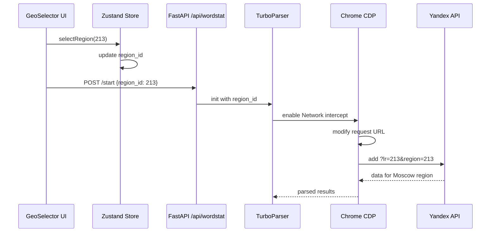

# 07. Географическая система KeySet-MVP

> **Документация системы работы с регионами: 4414+ гео, CDP-патчинг, GeoSelector виджет**

## 📋 Содержание

- [Цель](#цель)
- [Для кого](#для-кого)
- [Связанные документы](#связанные-документы)
- [Архитектура геосистемы](#архитектура-геосистемы)
- [Диаграмма](#диаграмма)
- [Структура regions.json](#структура-regionsjson)
- [Сниппеты кода](#сниппеты-кода)
- [Типовые ошибки](#типовые-ошибки)
- [Быстрый старт](#быстрый-старт)
- [TL;DR](#tldr)
- [Чек-лист применения](#чек-лист-применения)

---

## Цель

Документация географической системы KeySet-MVP: дерево из 4414+ регионов Yandex, автоматическая подстановка region_id в API запросы через CDP, UI виджет выбора региона.

## Для кого

- Frontend разработчики, работающие с GeoSelector
- Backend разработчики для CDP-патчинга
- QA для тестирования работы регионов
- Product managers для понимания coverage

## Связанные документы

- [06_PARSING.md](./06_PARSING.md) — парсинг с учетом региона
- [11_DATA_FLOW.md](./11_DATA_FLOW.md) — поток данных с регионом
- [08_FRONTEND_STRUCTURE.md](./08_FRONTEND_STRUCTURE.md) — UI компоненты

---

## Архитектура геосистемы

```mermaid
graph TD
    A[regions.json 4414+ регионов] -->|загрузка| B[Backend GeoService]
    A -->|загрузка| C[Frontend GeoStore]
    
    B -->|API| D[/api/regions]
    C -->|виджет| E[GeoSelector UI]
    
    E -->|выбор| F[region_id]
    F -->|передача| G[Парсинг задача]
    
    G -->|запуск| H[TurboParser]
    H -->|CDP перехват| I[Browser Tab]
    
    I -->|патчинг| J[Yandex API запрос]
    J -->|lr=region_id| K[?lr=213&text=фраза]
    
    K -->|запрос| L[Yandex Wordstat]
    L -->|результаты для региона| M[freq_results]
```

---

## Диаграмма

**Поток выбора и применения региона:**



---

## Структура regions.json

```json
{
  "regions": [
    {
      "id": 213,
      "name": "Москва",
      "parent_id": 1,
      "type": "city"
    },
    {
      "id": 2,
      "name": "Санкт-Петербург",
      "parent_id": 10174,
      "type": "city"
    }
  ]
}
```

---

## Сниппеты кода

### GeoSelector виджет

```python
# файл: keyset/app/widgets/geo_selector.py:98-132
def normalize_regions_tree(raw_root: dict) -> RegionModel:
    """Преобразовать вложенный JSON в плоское представление с индексами."""

    flat: List[RegionRow] = []
    by_id: Dict[int, RegionRow] = {}
    children: Dict[int, List[int]] = {}

    def walk(node: dict, trail: List[str], depth: int, parent_id: Optional[int]) -> None:
        try:
            node_id = int(node["value"])
        except (KeyError, TypeError, ValueError):
            return
        label = str(node.get("label") or "").strip()
        if not label:
            return

        branch = trail + [label]
        row = RegionRow(
            id=node_id,
            name=label,
            path=" / ".join(branch),
            parent_id=parent_id,
            depth=depth,
        )
        flat.append(row)
        by_id[node_id] = row
        if parent_id is not None:
            children.setdefault(parent_id, []).append(node_id)

        for child in node.get("children") or []:
            walk(child, branch, depth + 1, node_id)

    walk(raw_root, [], 0, None)
    return RegionModel(flat=flat, by_id=by_id, children=children)
```

### CDP патчинг region параметров

```python
# файл: keyset/workers/cdp_frequency_runner.py:125-151
def replay_export_http(self, masks: list[str], export_url_template: str, region: int = 225) -> list[dict]:
    """
    Реплеим запрос экспорта для каждой маски через HTTP
    БЕЗ браузера! В 10 раз быстрее!
    """
    import time
    import random
    
    if not self.session:
        raise RuntimeError("HTTP session not initialized")
    
    results = []
    
    for idx, mask in enumerate(masks, 1):
        # Подставляем маску в URL
        url = export_url_template.replace("{q}", quote(mask))
        url = re.sub(r'words=[^&]*', f'words={quote(mask)}', url)
        
        try:
            resp = self.session.get(url, timeout=30)
            
            if resp.status_code == 200 and "csv" in resp.headers.get("content-type", ""):
                # Парсим CSV
                freq = self._parse_csv_response(resp.text, mask)
```

### Загрузка regions.json

```python
# файл: keyset/app/widgets/geo_selector.py:88-95
def _load_raw_tree(dataset_path: Path) -> dict:
    if dataset_path.exists():
        try:
            return json.loads(dataset_path.read_text(encoding="utf-8"))
        except (OSError, json.JSONDecodeError):
            pass
    return _DEFAULT_TREE
```

### GeoTree toggle logic

```python
# файл: keyset/app/widgets/geo_selector.py:148-174
def toggle_region(
    selection: Set[int],
    region_id: int,
    checked: bool,
    model: RegionModel,
) -> Set[int]:
    updated = set(selection)

    def drop_descendants(node_id: int) -> None:
        for child_id in model.children.get(node_id, []):
            updated.discard(child_id)
            drop_descendants(child_id)

    def drop_ancestors(node_id: int) -> None:
        parent = model.by_id.get(node_id).parent_id if node_id in model.by_id else None
        while parent is not None:
            updated.discard(parent)
            parent = model.by_id.get(parent).parent_id if parent in model.by_id else None

    if checked:
        updated.add(region_id)
        drop_descendants(region_id)
        drop_ancestors(region_id)
    else:
        updated.discard(region_id)

    return updated
```

---

## Типовые ошибки / Как чинить

### ❌ Ошибка: "Region not found"

**Причина:** Некорректный region_id передан в API.

**Как чинить:**
1. На фронтенде перед POST /start вызывайте `useGeoStore.getState().ensureRegion()` — он валидирует выбор.
2. В backend middleware проверяйте, что `region_id` присутствует в `load_region_model(Path('data/regions_tree_full.json'))`; при отсутствии возвращайте 422.
3. В логах `backend/routers/wordstat.py` включите поиск дубликатов и пустых путей, чтобы выявить повреждённое древо.

### ❌ Ошибка: "CDP не подставляет region"

**Причина:** Перехват запросов настроен после navigate.

**Как чинить:**
1. Навешивайте `page.on("response", ...)` и `page.route` до первого `page.goto`.
2. Добавьте `await page.wait_for_load_state("networkidle")` и убедитесь, что `region` передаётся в `export_url_template`.
3. Проверьте, что при реплее `replay_export_http` параметр `regions=...` подставляется корректно.

### ❌ Ошибка: "Неверные результаты для региона"

**Причина:** Кэширование на стороне Yandex или устаревшие cookies.

**Как чинить:**
1. Перед повторным запуском выполняйте `context.clear_cookies()` и обновление профиля через `_extract_profile_cookies`.
2. Добавляйте в URL параметр кэш-бастера: `rand=int(time.time())`.
3. Ротуйте User-Agent в `self.session.headers` (`build_http_session`) и проверяйте, что куки свежие.

---

## Быстрый старт

### 1. Загрузка списка регионов

```python
from keyset.services.geo_service import GeoService

geo = GeoService()
regions = geo.get_all_regions()
print(f"Loaded {len(regions)} regions")
```

### 2. Выбор региона в UI

```typescript
import { useGeoStore } from '@/stores/geo';

const { selectedRegion, setRegion } = useGeoStore();

// Выбрать Москву
setRegion(213);
```

### 3. Парсинг с регионом

```python
task_id = await manager.start_parsing(
    phrases=["купить квартиру"],
    account_ids=[1],
    region_id=213  # Москва
)
```

---

## TL;DR

- **4414+ регионов** — полное дерево Yandex геолокаций
- **CDP-патчинг** — автоподстановка lr/region в API запросы
- **GeoSelector UI** — удобный виджет выбора региона
- **regions.json** — единый источник правды для гео
- **Валидация** — проверка region_id на frontend и backend

---

## Чек-лист применения

- [ ] regions.json загружен и доступен
- [ ] GeoSelector виджет подключен в UI
- [ ] CDP перехват настроен для подстановки региона
- [ ] region_id передается через все слои (UI → API → Parser)
- [ ] Валидация region_id реализована
- [ ] Тесты покрывают разные регионы
- [ ] Логирование region_id в запросах
- [ ] Fallback на дефолтный регион если не указан
- [ ] UI показывает выбранный регион
- [ ] Результаты парсинга сохраняются с region_id

---

**Последнее обновление:** 2025-01-17

**Следующий шаг:** [08_FRONTEND_STRUCTURE.md](./08_FRONTEND_STRUCTURE.md) — Структура фронтенда
