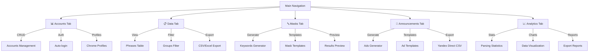
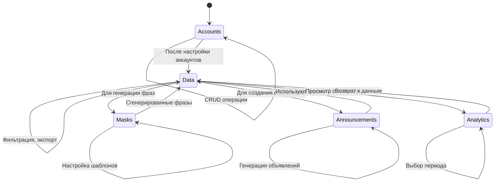

# 09. Обзор вкладок KeySet-MVP

> **Документация UI модулей: Аккаунты, Данные, Маски, Аналитика**

## 📋 Содержание

- [Цель](#цель)
- [Для кого](#для-кого)
- [Связанные документы](#связанные-документы)
- [Архитектура вкладок](#архитектура-вкладок)
- [Диаграмма навигации](#диаграмма-навигации)
- [Модули и функционал](#модули-и-функционал)
- [Сниппеты кода](#сниппеты-кода)
- [Типовые ошибки](#типовые-ошибки)
- [Быстрый старт](#быстрый-старт)
- [TL;DR](#tldr)
- [Чек-лист применения](#чек-лист-применения)

---

## Цель

Документация UI модулей KeySet-MVP: обзор функционала каждой вкладки, взаимодействие между модулями, компоненты и их назначение.

## Для кого

- Frontend разработчики для понимания структуры UI
- Product managers для feature mapping
- QA для тестирования функционала
- UX дизайнеры для улучшения интерфейса

## Связанные документы

- [08_FRONTEND_STRUCTURE.md](./08_FRONTEND_STRUCTURE.md) — архитектура frontend
- [10_API_INTEGRATION.md](./10_API_INTEGRATION.md) — API эндпоинты
- [11_DATA_FLOW.md](./11_DATA_FLOW.md) — потоки данных

---

## Архитектура вкладок



---

## Диаграмма навигации



---

## Модули и функционал

### 1. 📊 Accounts Tab (Аккаунты)

**Назначение:** Управление Yandex аккаунтами для парсинга

**Функционал:**
- ✅ Добавление/удаление аккаунтов
- ✅ Авто-логин через Chrome profiles (Playwright)
- ✅ Настройка прокси для аккаунтов
- ✅ Статусы: ok/cooldown/captcha/banned
- ✅ Запуск браузера с профилем
- ✅ Загрузка/удаление куков
- ✅ Фильтрация и поиск
- ✅ Массовый запуск браузеров
- ✅ Открытие папки профиля в проводнике

**Статус:** ✅ Готово (~85% - требуются улучшения мониторинга)

### 2. 📋 Data Tab (Данные)

**Назначение:** Просмотр и управление спарсенными фразами

**Функционал:**
- ✅ Таблица всех фраз с показателями (WS, "WS", !WS)
- ✅ Группировка по категориям (древовидная структура)
- ✅ Фильтрация по региону, дате, группе, статусу
- ✅ Экспорт в CSV/Excel
- ✅ Массовое удаление/перемещение фраз
- ✅ Импорт фраз из файлов
- ✅ Поиск дубликатов
- ✅ Стоп-слова (минус-слова)
- ✅ История изменений (Undo/Redo)
- ✅ Статистика по фразам
- ✅ Горячие клавиши
- ✅ Drag & Drop для перемещения
- ⚠️ Морфологические дубликаты (в разработке)
- ⚠️ Кросс-минусация (в разработке)
- ⚠️ Автоматизация задач (в разработке)

**Статус:** ✅ Готово (~90% - требуются доработки расширенных фич)

### 3. 🔤 Masks Tab (Маски)

**Назначение:** Генерация ключевых слов по шаблонам

**Функционал:**
- ✅ Древовидный редактор масок (XMind-style)
- ✅ Создание узлов и подузлов
- ✅ Drag & Drop для перестановки
- ✅ Генерация комбинаций из дерева
- ✅ Копирование в буфер обмена
- ✅ Импорт/экспорт XMind файлов
- ✅ Визуализация дерева (D3.js)
- ⚠️ Интеграция с Data Tab (требуется доработка)
- ⚠️ Сохранение шаблонов (требуется доработка)

**Статус:** ⚠️ В разработке (~75% - требуется интеграция с системой)

### 4. 📢 Announcements Tab (Объявления)

**Назначение:** Генерация рекламных объявлений для Яндекс Директа

**Функционал:**
- Создание объявлений по шаблонам
- Автоматическая генерация заголовков и текстов
- Настройка быстрых ссылок и уточнений
- Интеграция с фразами из Data Tab
- Поддержка динамических параметров (UTM метки)
- Экспорт в формат Яндекс Директа (CSV)
- Предпросмотр объявлений
- Массовое редактирование

**Статус:** ⚠️ В разработке (~70% готовности)

---

### 5. 📈 Analytics Tab (Аналитика)

**Назначение:** Статистика и визуализация данных

**Функционал:**
- Графики парсинга по времени
- Топ фраз по показам
- Статистика по регионам
- Производительность аккаунтов
- Экспорт отчетов
- OAuth интеграция с Яндекс API

**Статус:** ⚠️ В разработке (~40% готовности)

---

## Сниппеты кода

### Accounts Module

```typescript
// файл: frontend/src/modules/accounts/index.tsx:26-41
const loadAccounts = useCallback(async () => {
  setIsLoading(true);
  setError(null);
  try {
    const data = await fetchAccounts();
    setAccounts(data);
  } catch (loadError) {
    setAccounts([]);
    setError(
      (loadError as Error).message ||
        "Не удалось загрузить аккаунты. Проверьте backend."
    );
  } finally {
    setIsLoading(false);
  }
}, []);
```

### Data Module

```typescript
// файл: frontend/src/modules/data/App.tsx:63-84
const { 
  selectedPhraseIds, 
  phrases,
  groups,
  clearFilters,
  deletePhrases, 
  selectAll, 
  deselectAll,
  invertSelection,
  undo,
  redo,
  canUndo,
  canRedo,
  addLog,
  movePhrasesToGroup,
  copyPhrasesToGroup,
  updateGroupParent,
  loadInitialData,
  isDataLoaded,
  isDataLoading,
  dataError,
} = useStore();
```

### Masks Module (генератор)

```typescript
// файл: frontend/src/modules/masks/lib/stream-generator.ts:25-50 (упрощено)
export async function* generateStream(
  template: string,
  options: GeneratorOptions
): AsyncGenerator<GeneratedPhrase> {
  const lines = template.split('\\n').filter(l => l.trim());
  let counter = 0;
  
  for (const line of lines) {
    // Обработка шаблона с подстановками
    const processed = processTemplate(line, options);
    
    for (const variant of processed) {
      yield {
        id: `${Date.now()}-${counter++}`,
        text: variant,
        source: 'mask-generator'
      };
      
      // Пауза для избежания блокировки UI
      if (counter % 100 === 0) {
        await new Promise(r => setTimeout(r, 0));
      }
    }
  }
}
```

### Analytics Module

```typescript
// файл: frontend/src/modules/analytics/App.tsx (концепт — модуль находится в разработке)
// Пример структуры:
export default function AnalyticsModule() {
  const [stats, setStats] = useState<ParsingStats | null>(null);
  
  useEffect(() => {
    fetchParsingStatistics().then(setStats);
  }, []);
  
  return (
    <div>
      <h1>Статистика парсинга</h1>
      {stats && <StatsChart data={stats} />}
    </div>
  );
}
```

---

## Типовые ошибки / Как чинить

### ❌ Ошибка: "Table not rendering data"

**Причина:** Zustand store не загружен или данные ещё не готовы.

**Как чинить:**
1. Убедитесь, что `loadInitialData()` вызывается в `useEffect` при монтировании Data модуля.
2. Показывайте `Loader2` (см. `App.tsx`) пока `isDataLoading === true`.
3. Логируйте `dataError` и отображайте его в `StatusBar`.

### ❌ Ошибка: "Filter not working"

**Причина:** State не обновляется или фильтр применяется к неверному полю.

**Как чинить:**
1. Проверьте селекторы в `useStore` — фильтры должны обновлять `filters` внутри Zustand.
2. Используйте `useMemo` и функции `filterAccounts`/`applyFilters` для чистых вычислений.
3. Добавьте debounce (например, `useDebounce`) для текстовых инпутов, чтобы предотвратить лишние ререндеры.

### ❌ Ошибка: "Export produces empty file"

**Причина:** Экспорт запускается до загрузки данных или не выбраны строки.

**Как чинить:**
1. Перед экспортом проверяйте `phrases.length` и выводите предупреждение через `addLog('warning', ...)`.
2. Для массового экспорта используйте `MassBulkPanel` — он проверяет выделенные строки.
3. Убедитесь, что `exportToCSV` получает чистый массив объектов (без `Set`/`Map`).

---

## Быстрый старт

### 1. Навигация между вкладками

```typescript
import { useNavigate } from 'react-router-dom';

const navigate = useNavigate();

// Переход на вкладку Data
navigate('/data');
```

### 2. Загрузка данных модуля

```typescript
import { useDataStore } from '@/stores/dataStore';

const { phrases, fetchPhrases } = useDataStore();

useEffect(() => {
  fetchPhrases();
}, []);
```

### 3. Экспорт данных

```typescript
import { exportToCSV } from '@/lib/export';

const handleExport = () => {
  exportToCSV(phrases, 'phrases.csv');
};
```

---

## TL;DR

- **Accounts** (~85%) — управление Yandex аккаунтами, автологин, прокси
- **Data** (~90%) — просмотр и фильтрация фраз, экспорт, группировка
- **Masks** (~75%) — генерация ключевых слов, XMind редактор
- **Announcements** (~70%) — генерация объявлений для Яндекс Директа
- **Analytics** (~40%) — статистика и отчеты (в разработке)
- **React Router v7** — навигация между модулями
- **Zustand** — state management для каждого модуля
- **Playwright** — автоматизация браузера для парсинга

---

## Чек-лист применения

### Accounts Module
- [x] CRUD операции работают
- [x] Auto-login через Playwright
- [x] Запуск браузера с профилем
- [x] Управление куками
- [x] Фильтрация и поиск
- [ ] Мониторинг статусов в реальном времени

### Data Module
- [x] Таблица отображает фразы
- [x] Фильтры применяются
- [x] Экспорт в CSV/Excel работает
- [x] Импорт фраз
- [x] Группировка работает
- [x] История изменений (Undo/Redo)
- [ ] Морфологические дубликаты
- [ ] Кросс-минусация
- [ ] Автоматизация задач

### Masks Module
- [x] Древовидный редактор
- [x] Генерация по шаблонам
- [x] Импорт/экспорт XMind
- [x] Визуализация D3.js
- [ ] Интеграция с Data Tab
- [ ] Сохранение шаблонов в БД

### Announcements Module
- [x] Генератор объявлений
- [x] Шаблоны объявлений
- [x] Экспорт в Яндекс Директ
- [ ] Интеграция с фразами из Data
- [ ] Сохранение шаблонов

### Analytics Module
- [x] Базовая структура
- [x] OAuth callback
- [ ] Графики отображаются
- [ ] Интеграция с реальными данными
- [ ] Экспорт отчетов работает

---

**Последнее обновление:** 2025-01-17

**Следующий шаг:** [10_API_INTEGRATION.md](./10_API_INTEGRATION.md) — API интеграция
