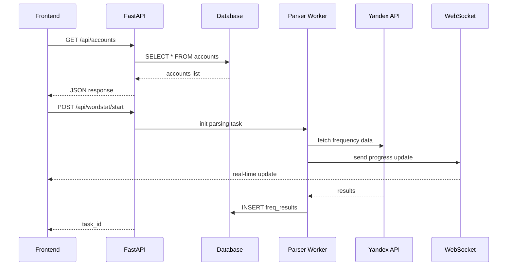

# 10. API интеграция KeySet-MVP

> **Документация REST API: FastAPI endpoints, WebSocket real-time, интеграция с Yandex**

## 📋 Содержание

- [Цель](#цель)
- [Для кого](#для-кого)
- [Связанные документы](#связанные-документы)
- [Архитектура API](#архитектура-api)
- [Диаграмма эндпоинтов](#диаграмма-эндпоинтов)
- [REST API endpoints](#rest-api-endpoints)
- [Сниппеты кода](#сниппеты-кода)
- [Типовые ошибки](#типовые-ошибки)
- [Быстрый старт](#быстрый-старт)
- [TL;DR](#tldr)
- [Чек-лист применения](#чек-лист-применения)

---

## Цель

Документация REST API KeySet-MVP: FastAPI endpoints для управления аккаунтами, запуска парсинга, получения данных, WebSocket для real-time обновлений.

## Для кого

- Backend разработчики для расширения API
- Frontend разработчики для интеграции
- QA для тестирования API
- DevOps для настройки deployment

## Связанные документы

- [08_FRONTEND_STRUCTURE.md](./08_FRONTEND_STRUCTURE.md) — frontend клиент
- [06_PARSING.md](./06_PARSING.md) — парсинг система
- [11_DATA_FLOW.md](./11_DATA_FLOW.md) — потоки данных
- [01_DATABASE.md](./01_DATABASE.md) — модели данных

---

## Архитектура API

```mermaid
graph TD
    A[Frontend Client] -->|HTTP/REST| B[FastAPI Server]
    A -->|WebSocket| C[WS Handler]
    
    B --> D1[/api/accounts]
    B --> D2[/api/data]
    B --> D3[/api/wordstat]
    B --> D4[/api/proxy]
    B --> D5[/api/regions]
    
    D1 --> E[Database Layer]
    D2 --> E
    D3 --> F[Parsing Worker]
    
    F --> G[TurboParser]
    G --> H[Yandex Wordstat API]
    
    C -->|updates| A
    F -->|progress| C
```

---

## Диаграмма эндпоинтов



---

## REST API endpoints

### Accounts Management (`/api/accounts`)

| Method | Endpoint | Description |
|--------|----------|-------------|
| GET | `/api/accounts` | Список всех аккаунтов |
| POST | `/api/accounts` | Создать аккаунт |
| GET | `/api/accounts/{id}` | Получить аккаунт по ID |
| PUT | `/api/accounts/{id}` | Обновить аккаунт |
| DELETE | `/api/accounts/{id}` | Удалить аккаунт |
| POST | `/api/accounts/{id}/launch` | Запустить браузер для аккаунта |
| POST | `/api/accounts/launch` | Массовый запуск браузеров |
| POST | `/api/accounts/{id}/autologin` | Выполнить автологин |
| POST | `/api/accounts/{id}/cookies` | Загрузить куки из файла |
| DELETE | `/api/accounts/{id}/cookies` | Удалить куки |
| GET/POST | `/api/accounts/profiles-root/open` | Открыть папку профилей |
| POST | `/api/accounts/{id}/profile/open` | Открыть папку профиля |
| POST | `/api/accounts/{id}/profile/ensure` | Создать папку профиля |

### Data Management (`/api/data`)

| Method | Endpoint | Description |
|--------|----------|-------------|
| GET | `/api/data/phrases` | Список фраз (с пагинацией, фильтрами) |
| GET | `/api/data/groups` | Список групп |
| POST | `/api/data/phrases/enqueue` | Добавить фразы в очередь |
| POST | `/api/data/phrases/delete` | Удалить фразы (массово) |
| POST | `/api/data/phrases/clear` | Очистить все фразы |
| POST | `/api/data/phrases/group` | Обновить группу для фраз |
| POST | `/api/data/delete` | Удалить фразы (альтернативный endpoint) |
| GET | `/api/data/export` | Экспорт фраз в CSV |

### Parsing / Wordstat (`/api/wordstat`)

| Method | Endpoint | Description |
|--------|----------|-------------|
| GET | `/api/wordstat/accounts` | Список аккаунтов для парсинга |
| GET | `/api/wordstat/regions` | Список регионов |
| POST | `/api/wordstat/collect` | Запуск парсинга (одиночный аккаунт) |
| POST | `/api/wordstat/multi-collect` | Запуск парсинга (мультипарсер) |

### Proxy Management (`/api/proxies`)

| Method | Endpoint | Description |
|--------|----------|-------------|
| GET | `/api/proxies` | Список прокси |
| POST | `/api/proxies` | Создать прокси |
| PUT | `/api/proxies/{id}` | Обновить прокси |
| DELETE | `/api/proxies/{id}` | Удалить прокси |
| POST | `/api/proxies/check` | Проверить прокси |

### Geo System (`/api/regions`)

| Method | Endpoint | Description |
|--------|----------|-------------|
| GET | `/api/regions` | Дерево регионов (4414+ регионов) |

### Analytics (`/api/analytics`)

| Method | Endpoint | Description |
|--------|----------|-------------|
| GET | `/api/analytics` | Получить статистику (mock) |

### Utility

| Method | Endpoint | Description |
|--------|----------|-------------|
| GET | `/api/health` | Healthcheck endpoint |
| POST | `/api/debug/react-error` | Логирование ошибок React |

---

## Сниппеты кода

### FastAPI router (accounts)

```python
# файл: backend/routers/accounts.py:138-157
@router.get("", response_model=List[AccountPayload])
def list_accounts() -> List[AccountPayload]:
    """Вернуть аккаунты из старой БД без моков."""
    if legacy_accounts is None:
        raise HTTPException(
            status_code=500,
            detail="Сервис аккаунтов недоступен. Убедитесь, что каталог keyset/ присутствует.",
        )
    try:
        rows = legacy_accounts.list_accounts()
    except Exception as exc:
        logger.exception("Failed to load accounts from legacy service: %s", exc)
        raise HTTPException(status_code=500, detail=str(exc)) from exc

    payload = [
        _serialize_account(record)
        for record in rows
        if getattr(record, "profile_path", None)
    ]
    return payload
```

### FastAPI router (wordstat)

```python
# файл: backend/routers/wordstat.py:234-275
@router.post("/collect", response_model=list[CollectResponseRow])
def collect_frequency(payload: CollectRequest) -> list[CollectResponseRow]:
    """Запустить TurboWordstatParser и вернуть частоты."""
    modes = payload.modes.enabled()
    if not any(modes.values()):
        raise HTTPException(status_code=422, detail="Выберите хотя бы один режим частотности.")

    _ensure_wordstat_available()
    try:
        results = wordstat_bridge.collect_frequency(
            payload.phrases,
            modes=modes,
            regions=payload.regions,
            profile=payload.profile,
        )
    except RuntimeError as exc:
        raise HTTPException(status_code=502, detail=str(exc)) from exc
    except Exception as exc:
        logger.exception("Wordstat parser crashed: %s", exc)
        raise HTTPException(status_code=500, detail="Wordstat parser error") from exc

    region_id = payload.regions[0] if payload.regions else None
    response: list[CollectResponseRow] = []
    for row in results or []:
        response.append(
            CollectResponseRow(
                phrase=str(row.get("phrase") or "").strip(),
                ws=_safe_int(row.get("ws")),
                qws=_safe_int(row.get("qws")),
                bws=_safe_int(row.get("bws")),
                status=str(row.get("status") or "OK"),
                region=region_id,
            )
        )

    if region_id is not None and results:
        try:
            frequency_service.upsert_results(results, region_id)
        except Exception as exc:
            logger.warning("Failed to persist Wordstat results: %s", exc)

    return response
```

### WebSocket handler (концепт)

```python
# файл: backend/main.py (пример WebSocket эндпоинта)
@app.websocket("/ws")
async def websocket_endpoint(websocket: WebSocket):
    await websocket.accept()
    try:
        while True:
            data = await websocket.receive_text()
            # Обработка команд от клиента
            await websocket.send_json({"status": "ok", "message": "Command received"})
    except WebSocketDisconnect:
        logger.info("WebSocket disconnected")
```

### Frontend API client

```typescript
// файл: frontend/src/modules/data/api/data.ts:66-80
export function fetchPhrases(params: FetchPhraseParams = {}): Promise<PhraseListResponse> {
  const query = new URLSearchParams();
  if (params.limit) query.set('limit', String(params.limit));
  if (params.offset) query.set('offset', String(params.offset));
  if (params.search) query.set('search', params.search);
  if (params.status) query.set('status', params.status);
  if (params.q) query.set('q', params.q);
  if (params.cursor !== undefined && params.cursor !== null) {
    query.set('cursor', String(params.cursor));
  }
  if (params.sort) query.set('sort', params.sort);

  const suffix = query.toString() ? `?${query.toString()}` : '';
  return request<PhraseListResponse>(`/phrases${suffix}`);
}
```

### Yandex API интеграция

```python
# файл: keyset/workers/turbo_parser_working.py:203-232
async def handle_response(response):
    if "/wordstat/api" not in response.url or response.status != 200:
        return
    data = await _parse_wordstat_json(response)
    if not data:
        return
    _normalize_wordstat_payload(data)

    phrase = fix_mojibake(_extract_phrase_from_request(response) or "")
    items = (data.get("table") or {}).get("items") or []
    if not phrase and items:
        phrase = fix_mojibake(items[0].get("phrase") or "").strip()
    if not phrase:
        return

    freq = data.get("totalValue")
    if freq is None and items:
        freq = items[0].get("count") or items[0].get("value")

    try:
        frequency = int(str(freq).replace(" ", "")) if freq is not None else None
    except Exception:
        frequency = None

    if frequency is None:
        return

    async with results_lock:
        results[phrase] = frequency
    log(f"    [+] {phrase}: {frequency:,}")
```

---

## Примеры запросов и ответов

### GET /api/accounts - Список аккаунтов

**Запрос:**
```bash
curl -X GET http://localhost:8000/api/accounts \
  -H "Accept: application/json"
```

**Ответ 200 OK:**
```json
[
  {
    "id": 1,
    "email": "user@yandex.ru",
    "password": "",
    "secretAnswer": "Тестовая заметка",
    "profilePath": "C:\\AI\\yandex\\.profiles\\user1",
    "status": "active",
    "proxy": "123.45.67.89:8080",
    "proxyUsername": "proxyuser",
    "proxyPassword": "",
    "proxyType": "http",
    "fingerprint": "no_spoofing",
    "lastLaunch": "2 ч назад",
    "authStatus": "Авторизован",
    "lastLogin": "2024-11-10 14:30",
    "profileSize": "—"
  }
]
```

**Ответ 500 Internal Server Error:**
```json
{
  "detail": "Сервис аккаунтов недоступен. Убедитесь, что каталог keyset/ присутствует."
}
```

### GET /api/wordstat/regions - Список регионов

**Запрос:**
```bash
curl -X GET http://localhost:8000/api/wordstat/regions \
  -H "Accept: application/json"
```

**Ответ 200 OK:**
```json
[
  {
    "id": 225,
    "name": "Россия",
    "path": "Россия",
    "parentId": null,
    "depth": 0,
    "hasChildren": true
  },
  {
    "id": 213,
    "name": "Москва",
    "path": "Россия / Москва",
    "parentId": 225,
    "depth": 1,
    "hasChildren": true
  },
  {
    "id": 2,
    "name": "Санкт-Петербург",
    "path": "Россия / Санкт-Петербург",
    "parentId": 225,
    "depth": 1,
    "hasChildren": false
  }
]
```

### POST /api/wordstat/collect - Запуск парсинга

**Запрос:**
```bash
curl -X POST http://localhost:8000/api/wordstat/collect \
  -H "Content-Type: application/json" \
  -d '{
    "phrases": ["купить квартиру", "аренда дома"],
    "modes": {"ws": true, "qws": false, "bws": false},
    "regions": [213],
    "profile": null
  }'
```

**Ответ 200 OK:**
```json
[
  {
    "phrase": "купить квартиру",
    "ws": 125000,
    "qws": null,
    "bws": null,
    "status": "OK",
    "region": 213
  },
  {
    "phrase": "аренда дома",
    "ws": 89000,
    "qws": null,
    "bws": null,
    "status": "OK",
    "region": 213
  }
]
```

**Ответ 422 Validation Error:**
```json
{
  "detail": [
    {
      "loc": ["body", "phrases"],
      "msg": "Передайте хотя бы одну фразу для парсинга.",
      "type": "value_error"
    }
  ]
}
```

**Ответ 502 Bad Gateway:**
```json
{
  "detail": "TurboParser не смог подключиться к Yandex API. Проверьте cookies и профиль."
}
```

### GET /api/data/phrases - Получение фраз (с пагинацией)

**Запрос:**
```bash
curl -X GET "http://localhost:8000/api/data/phrases?limit=100&cursor=500&sort=ws_desc" \
  -H "Accept: application/json"
```

**Ответ 200 OK:**
```json
{
  "items": [
    {
      "id": 501,
      "phrase": "купить квартиру москва",
      "ws": 150000,
      "qws": 120000,
      "bws": 5000,
      "status": "OK",
      "group": "недвижимость",
      "region": 213,
      "updatedAt": "2024-11-10T12:00:00Z"
    },
    {
      "id": 502,
      "phrase": "снять квартиру центр",
      "ws": 98000,
      "qws": 75000,
      "bws": 3200,
      "status": "OK",
      "group": "аренда",
      "region": 213,
      "updatedAt": "2024-11-10T12:05:00Z"
    }
  ],
  "nextCursor": 600,
  "hasMore": true
}
```

**Ответ 404 Not Found:**
```json
{
  "detail": "Cursor not found or expired"
}
```

### POST /api/data/import - Импорт CSV

**Запрос:**
```bash
curl -X POST http://localhost:8000/api/data/import \
  -H "Content-Type: multipart/form-data" \
  -F "file=@phrases.csv"
```

**Ответ 200 OK:**
```json
{
  "imported": 1500,
  "skipped": 50,
  "duplicates": 25,
  "errors": []
}
```

**Ответ 400 Bad Request:**
```json
{
  "detail": "Invalid CSV format: missing 'phrase' column"
}
```

### GET /api/data/export - Экспорт в CSV

**Запрос:**
```bash
curl -X GET "http://localhost:8000/api/data/export?format=csv&group=недвижимость" \
  -H "Accept: text/csv" \
  -o export.csv
```

**Ответ 200 OK (Content-Type: text/csv):**
```csv
phrase,ws,qws,bws,status,region
купить квартиру москва,150000,120000,5000,OK,213
снять квартиру центр,98000,75000,3200,OK,213
```

**Ответ 204 No Content:**
```
(пустой ответ - нет данных для экспорта)
```

---

## Типовые ошибки / Как чинить

### ❌ Ошибка: "CORS policy blocking requests"

**Причина:** CORS не настроен на backend.

**Как чинить:**
1. В `backend/main.py` добавьте `CORSMiddleware` с whitelists для фронтенд-URL.
2. Для production пропишите конкретный origin (например, `https://panel.keyset.ru`).
3. Если требуются cookies, включите `allow_credentials=True` и проконтролируйте, что proxy не отбрасывает заголовки.

### ❌ Ошибка: "422 Validation Error"

**Причина:** Некорректная структура request body или отсутствуют обязательные поля.

**Как чинить:**
1. Сверьте JSON с Pydantic-моделями (`CollectRequest`, `AccountPayload`).
2. На фронте проверьте, что формы валидируются до отправки (Zod/React Hook Form).
3. Логируйте `exc.errors()` и возвращайте понятные сообщения клиенту.

### ❌ Ошибка: "WebSocket connection failed"

**Причина:** WS endpoint недоступен, неверный URL или блокировка proxy.

**Как чинить:**
1. Убедитесь, что backend запущен и маршрут `/ws` зарегистрирован.
2. Проверьте URL: `ws://localhost:8000/ws` (для production используйте `wss://`).
3. Если стоит nginx/Traefik, пробросьте заголовки `Upgrade` и `Connection: upgrade`.

---

## Быстрый старт

### 1. Запуск FastAPI сервера

```bash
cd backend
uvicorn app.main:app --reload --port 8000
```

### 2. Тест API endpoint

```bash
curl http://localhost:8000/api/accounts
```

### 3. Frontend API client

```typescript
import axios from 'axios';

const api = axios.create({
  baseURL: 'http://localhost:8000/api',
});

// Получить аккаунты
const accounts = await api.get('/accounts');
```

### 4. WebSocket connection

```typescript
const ws = new WebSocket('ws://localhost:8000/ws');

ws.onmessage = (event) => {
  const data = JSON.parse(event.data);
  console.log('Update:', data);
};
```

---

## TL;DR

- **FastAPI** — современный async framework
- **REST endpoints** — CRUD для всех сущностей
- **WebSocket** — real-time обновления
- **Pydantic** — валидация request/response
- **CORS** — настроен для frontend
- **Yandex API** — интеграция через CDP

---

## Чек-лист применения

- [ ] FastAPI сервер запущен
- [ ] CORS настроен для frontend origin
- [ ] Все endpoints отдают корректный JSON
- [ ] Pydantic схемы валидируют данные
- [ ] WebSocket handler реализован
- [ ] Error handling добавлен во все endpoints
- [ ] Логирование запросов настроено
- [ ] Rate limiting настроен (если нужен)
- [ ] API документация доступна (/docs)
- [ ] Frontend успешно подключается к API

---

**Последнее обновление:** 2025-01-17

**Следующий шаг:** [11_DATA_FLOW.md](./11_DATA_FLOW.md) — Потоки данных
