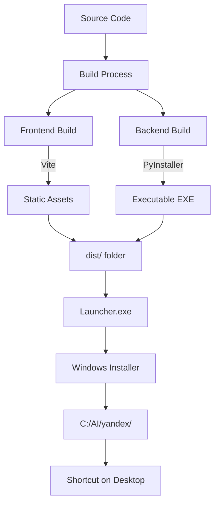
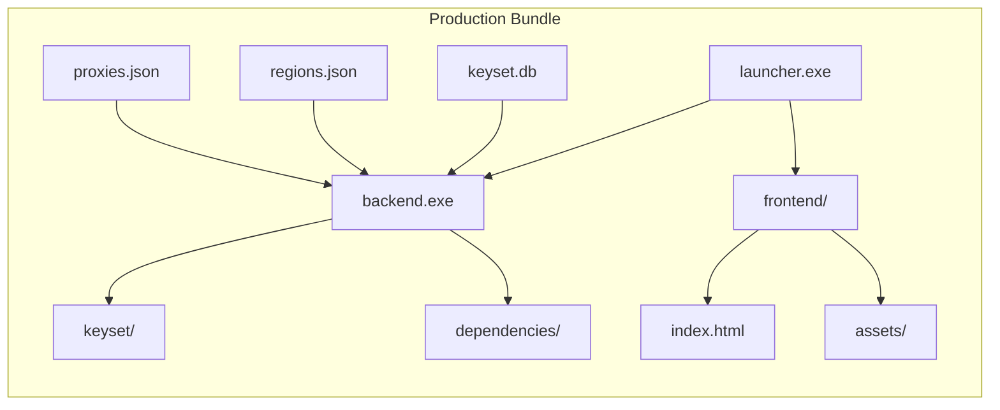

# 12. Production Windows Build KeySet-MVP

> **Документация сборки production версии для Windows: PyInstaller, standalone, launcher**

## 📋 Содержание

- [Цель](#цель)
- [Для кого](#для-кого)
- [Связанные документы](#связанные-документы)
- [Архитектура production сборки](#архитектура-production-сборки)
- [Диаграмма компонентов](#диаграмма-компонентов)
- [Процесс сборки](#процесс-сборки)
- [Сниппеты кода](#сниппеты-кода)
- [Типовые ошибки](#типовые-ошибки)
- [Быстрый старт](#быстрый-старт)
- [TL;DR](#tldr)
- [Чек-лист применения](#чек-лист-применения)

---

## Цель

Документация процесса сборки standalone Windows приложения KeySet-MVP: PyInstaller для Python backend, Vite build для frontend, launcher скрипт, инсталлятор.

## Для кого

- DevOps инженеры для CI/CD
- Release managers
- Developers для локальной сборки
- Support для troubleshooting установки

## Связанные документы

- [08_FRONTEND_STRUCTURE.md](./08_FRONTEND_STRUCTURE.md) — frontend сборка
- [13_SECURITY_NOTES.md](./13_SECURITY_NOTES.md) — безопасность release
- [14_LOGGING_OBSERVABILITY.md](./14_LOGGING_OBSERVABILITY.md) — логи в production

---

## Архитектура production сборки



---

## Диаграмма компонентов



---

## Инструменты и версии

- **Python** 3.11.8 (x64)
- **Node.js** ≥ 18.18
- **pnpm** 9.x (или npm ≥ 9)
- **PyInstaller** 6.10
- **Inno Setup** 6.3.3
- **Playwright** 1.47 (chromium установлен через `npx playwright install chromium --with-deps`)

---

## Процесс сборки

### 1. Frontend build (Vite)

```bash
cd frontend
pnpm install
pnpm run build
# Создаёт frontend/dist/ с manifest.json и assets
```

### 2. Backend + launcher (PyInstaller)

```bash
cd ..
pyinstaller build/keyset.spec
# Артефакты: dist/KeySetLauncher.exe, dist/keyset-backend.exe, дистрибутив frontend
```

### 3. Installer (Inno Setup)

```bash
iscc build/keyset_installer.iss
# Выход: build/output/KeySetSetup.exe
```

### 4. Smoke-test на чистой Windows VM

1. **Среда**: Windows 11 Pro, без установленного Python/Node.
2. Скопировать папку `dist/` и запустить `KeySet.exe` — убедиться, что backend стартует и Edge открывается в app-режиме.
3. Проверить, что окно Edge открывает UI без адресной строки (вкладка Accounts загружается, меню работает).
4. Запустить `KeySetSetup.exe`, установить в `C:\AI\KeySet`.
5. Из меню «Пуск» открыть KeySet — приложение должно стартовать, ярлыки и uninstall присутствуют.
6. Выполнить smoke-сценарий: импортировать CSV (100 строк), отправить парсинг (mock-данные), проверить лог `logs/app.log`.

### 5. Итоговая структура dist/

```
dist/
├── KeySet.exe          # Единый исполняемый файл (все включено)
└── keyset.db          # База данных (создается при первом запуске)
```

---

## Сниппеты кода

### PyInstaller spec файл (пример)

```python
# файл: build/keyset.spec (создайте этот файл)
# -*- mode: python -*-
from pathlib import Path

project_root = Path(__file__).resolve().parents[1]
frontend_dist = project_root / "frontend" / "dist"

def collect_frontend():
    if frontend_dist.exists():
        return [(str(frontend_dist), "frontend")]
    raise RuntimeError("frontend/dist отсутствует. Запустите pnpm run build")

a = Analysis(
    ['launcher.py'],
    pathex=[str(project_root)],
    binaries=[],
    datas=[
        (str(project_root / 'backend'), 'backend'),
        *collect_package('core'),
        *collect_package('services'),
        *collect_package('utils'),
        *collect_frontend(),
    ],
    hiddenimports=['playwright._impl._backend', 'uvicorn', 'fastapi'],
    hookspath=[],
    win_private_assemblies=False,
    cipher=None,
)
pyz = PYZ(a.pure, cipher=None)
exe = EXE(
    pyz, a.scripts, a.binaries, a.zipfiles, a.datas,
    name='KeySetLauncher',
    debug=False,
    console=False,
    icon='assets/icon.ico' if (project_root / 'assets' / 'icon.ico').exists() else None,
)
```

### Inno Setup installer (пример)

```ini
; файл: build/keyset_installer.iss
[Setup]
AppName=KeySet
AppVersion=1.0.0
DefaultDirName={pf}\KeySet
DefaultGroupName=KeySet
OutputDir=build\output
OutputBaseFilename=KeySetSetup
Compression=lzma
SolidCompression=yes
PrivilegesRequired=admin
ArchitecturesAllowed=x64

[Files]
Source: "dist\KeySetLauncher.exe"; DestDir: "{app}"; Flags: ignoreversion
Source: "dist\keyset-backend.exe"; DestDir: "{app}"; Flags: ignoreversion
Source: "dist\frontend\*"; DestDir: "{app}\frontend"; Flags: recursesubdirs createallsubdirs
Source: "dist\regions.json"; DestDir: "{app}"; Flags: ignoreversion

[Icons]
Name: "{group}\KeySet"; Filename: "{app}\KeySetLauncher.exe"
Name: "{group}\Удалить KeySet"; Filename: "{uninstallexe}"
```

### Launcher скрипт

```python
# файл: launcher.py:129-138
def run_backend() -> None:
    """Start FastAPI backend inside the current process."""
    config = Config(
        "backend.main:app",
        host=BACKEND_HOST,
        port=BACKEND_PORT,
        reload=False,
        log_level="info",
    )
    Server(config).run()
```

### START.bat скрипт

```bat
:: файл: START.bat
@echo off
cd /d %~dp0
start KeySetLauncher.exe
timeout /t 2 >nul
start msedge.exe http://127.0.0.1:8765
```

---

## Типовые ошибки / Как чинить

### ❌ Ошибка: "PyInstaller missing module"

**Причина:** Неполный список hidden imports.

**Как чинить:**
1. Добавьте в spec файл `hiddenimports=['playwright._impl._backend', 'uvicorn', 'fastapi']`.
2. Убедитесь, что установлен `pywin32` (иначе launcher не получит Win32 API).
3. Повторно соберите: `pyinstaller build/keyset.spec --clean`.

### ❌ Ошибка: "Frontend static files not found"

**Причина:** В dist отсутствует папка frontend или неверный путь в spec/installer.

**Как чинить:**
1. Перед сборкой PyInstaller запустите `pnpm run build` и проверьте `frontend/dist/index.html`.
2. В `keyset.spec` используйте функцию `collect_frontend()` и убедитесь, что Inno копирует `dist\frontend\*`.
3. Для отладки запустите `KeySetLauncher.exe --devtools` и убедитесь в корректности путей.

### ❌ Ошибка: "Database locked"

**Причина:** Несколько экземпляров backend используют один SQLite файл.

**Как чинить:**
1. В `keyset/core/db.py` включите WAL режим (`PRAGMA journal_mode=WAL;` при инициализации).
2. Открывайте приложение в одном экземпляре или делегируйте повторный запуск через Windows Task Scheduler.
3. Перед упаковкой очистите `logs/` и убедитесь, что приложение корректно завершает соединения (см. `SessionLocal`).

---

## Быстрый старт

### 1. Сборка локально

```bash
# 1. Frontend
cd frontend
npm run build

# 2. Backend
pip install pyinstaller
pyinstaller keyset.spec

# 3. Package
python scripts/package.py
```

### 2. Тестирование сборки

```bash
cd dist
./launcher.exe
```

### 3. Создание инсталлятора

```bash
# Использовать Inno Setup или NSIS
iscc setup.iss
```

---

## TL;DR

- **Vite build** — минифицированный frontend
- **PyInstaller** — standalone Python EXE
- **Launcher** — запускает backend + открывает frontend
- **START.bat** — альтернативный способ запуска
- **Installer** — Inno Setup для Windows

---

## Чек-лист применения

- [ ] Frontend собирается без ошибок (npm run build)
- [ ] Backend собирается в EXE (PyInstaller)
- [ ] Все зависимости включены в сборку
- [ ] Database файл копируется в dist/
- [ ] regions.json и другие JSON включены
- [ ] Launcher корректно запускает backend
- [ ] Frontend доступен на localhost:8000
- [ ] Icon добавлен в EXE
- [ ] Version info указан в executable
- [ ] Installer создаёт shortcuts
- [ ] Uninstaller работает корректно

---

**Последнее обновление:** 2025-01-17

**Следующий шаг:** [13_SECURITY_NOTES.md](./13_SECURITY_NOTES.md) — Безопасность
